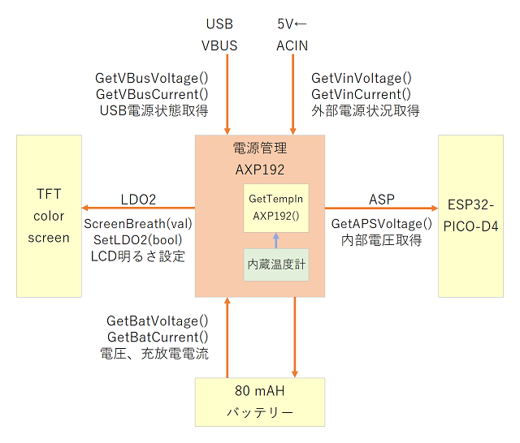

# 電源管理(AXP192)

## 概要

外部からの電源入力(USB or 外部電源端子)と、内蔵バッテリー充放電管理、LCDバックライトの明るさ管理などを行う。



## データシート

- 電源管理 [AXP192](https://github.com/m5stack/M5-Schematic/blob/master/Core/AXP192%20Datasheet%20v1.13_cn.pdf)

## メンバー

### コンストラクタ AXP192()
処理なし
```c
AXP192::AXP192()
```


### 開始 begin()
各種初期化
```c
void AXP192::begin(void)
```


### 液晶バックライト電圧設定 ScreenBreath()
7でかなり暗いが見えるぐらいの明るさです。0-6も利用できるが、明るい場所では画面が見えないです。
```c
void AXP192::ScreenBreath(uint8_t brightness)
```

!!! summary "引数"
	- uint8_t `brightness` 7(2.5V：暗い)から12(3.0V：明るい)の6段階

!!! Tip "利用例"
	```c
	M5.Axp.ScreenBreath( 7 ); // 一番暗くする(2.5V)
	delay(1000);
	M5.Axp.ScreenBreath( 12 ); // 一番明るくする(3.0V) 
	```


### 容量カウンタ有効化 EnableCoulombcounter()
通常使いません
```c
void AXP192::EnableCoulombcounter(void)
```


### 容量カウンタ無効化 DisableCoulombcounter()
通常使いません
```c
void AXP192::DisableCoulombcounter(void)
```


### 容量カウンタ停止 StopCoulombcounter()
通常使いません
```c
void AXP192::StopCoulombcounter(void)
```


### 容量カウンタクリア ClearCoulombcounter()
通常使いません
```c
void AXP192::ClearCoulombcounter(void)
```


### 充電カウンタ取得 GetCoulombchargeData()
通常使いません
```c
uint32_t AXP192::GetCoulombchargeData(void)
```

!!! note "戻り値"
	充電カウンタ


### 放電カウンタ取得 GetCoulombdischargeData()
通常使いません
```c
uint32_t AXP192::GetCoulombdischargeData(void)
```

!!! note "戻り値"
	放電カウンタ


### バッテリー容量取得 GetCoulombData()
バッテリー容量を取得します。バッテリーが劣化した場合、最初の値まで充電できないのでこの数値を使って残量計算をしないでください。
```c
float AXP192::GetCoulombData(void)
```

!!! note "戻り値"
	バッテリー容量のmAhが戻ってくる(0-80前後の値)

!!! Tip "利用例"
	```c
	double coulomb = M5.Axp.GetCoulombData(); // mAhが戻ってくる(0-80前後の値) 
	```


### バッテリー電圧取得 GetVbatData()
内部バッテリーの電圧です。バッテリーは4.2Vまで充電して、3.0V以下になったらシャットダウンします。 残量計算の場合には少しマージンを取って計算をしたほうが、バッテリーが劣化した場合にも安心だと思います。
```c
uint16_t AXP192::GetVbatData(void)
```

!!! note "戻り値"
	バッテリーの電圧Step数を返す

!!! Tip "利用例"
	```c
	double vbat = M5.Axp.GetVbatData() * 1.4; // mVに変換する 
	```


### バッテリー充電電流取得 GetIchargeData()
内部バッテリーの充電電流です。
```c
uint16_t AXP192::GetIchargeData(void)
```

!!! note "戻り値"
	バッテリーに充電している電流Step数を返す

!!! Tip "利用例"
	```c
	double icharge = M5.Axp.GetIchargeData() * 0.5; // mAに変換する 
	```


### バッテリー放電電流取得 GetIdischargeData()
内部バッテリーの放電電流です。0以外の場合には電源に繋がっておらず、充電されていない状態です。
```c
uint16_t AXP192::GetIdischargeData(void)
```

!!! note "戻り値"
	バッテリーから放電している電流Step数を返す

!!! Tip "利用例"
	```c
	double idischarge = M5.Axp.GetIdischargeData() * 0.5; // mAに変換する 
	```


### 内部温度取得 GetTempData()
気温とはかなり違う温度なので、あまり使うことはないと思います。
```c
uint16_t AXP192::GetTempData(void)
```

!!! note "戻り値"
	AXP192の内部温度Step数を返す

!!! Tip "利用例"
	```c
	double temp = -144.7 + M5.Axp.GetTempData() * 0.1; // 温度に変換する 
	```


### バッテリー瞬間電力取得 GetPowerbatData()
データシート上、明確な計算式がないので使わないほうが無難です。
```c
uint32_t AXP192::GetPowerbatData(void)
```

!!! note "戻り値"
	バッテリー瞬間電力を返す(計算方法不明)


### 外部電源電圧取得 GetVinData()
EXT_IOからの入力電圧です。
```c
uint16_t AXP192::GetVinData(void)
```

!!! note "戻り値"
	外部電源の電圧Step数を返す

!!! Tip "利用例"
	```c
	double vin = M5.Axp.GetVinData() * 1.7; // mVに変換する 
	```


### 外部電源電流取得 GetIinData()
EXT_IOからの入力電流です。
```c
uint16_t AXP192::GetIinData(void)
```

!!! note "戻り値"
	外部電源の電流Step数を返す

!!! Tip "利用例"
	```c
	double iin = M5.Axp.GetIinData() * 0.625; // mAに変換する 
	```


### 外部電源電流取得 GetVusbinData()
EXT_IOからの入力電流です。
```c
uint16_t AXP192::GetVusbinData(void)
```

!!! note "戻り値"
	外部電源の電流Step数を返す

!!! Tip "利用例"
	```c
	double vin = M5.Axp.GetVusbinData() * 1.7; // mVに変換する 
	```


### USB電源電流取得 GetIusbinData()
USB端子からの入力電流です。
```c
uint16_t AXP192::GetIusbinData(void)
```

!!! note "戻り値"
	USB電源の電流Step数を返す

!!! Tip "利用例"
	```c
	double iin = M5.Axp.GetIusbinData() * 0.375; // mAに変換する 
	```


### 内部動作電圧取得 GetVapsData()
内部に供給されている電圧を取得します。USBや外部電源の場合には5V前後で、バッテリー駆動の場合には4V前後になります。
```c
uint16_t AXP192::GetVapsData(void)
```

!!! note "戻り値"
	内部動作の電圧Step数を返す

!!! Tip "利用例"
	```c
	double vaps = M5.Axp.GetVapsData() *1.4; // mVに変換する 
	```


### 電源ボタン取得 GetBtnPress()
IRQステータスレジスタ3を取得。電源ボタンの状態を取得しています。 1秒ボタンを押した時に1になり、その後0に戻りますので注意してください。 1秒未満のボタンクリックは2が戻ってきます。
```c
uint8_t AXP192::GetBtnPress(void)
```

!!! note "戻り値"
	電源ボタンの状態を返す(0:押していないか1秒以上押している状態, 1:1秒の長押し発生, 2:1秒以下のボタンクリック)

!!! Tip "利用例"
	```c
	if( M5.Axp.GetBtnPress() == 2 ){
	 // ボタンクリック
	} 
	```


### スリープ状態に移行 SetSleep()
スリープ状態に移行します。画面は消えますが、CPU自体は動いている状態です。電源ボタンの1秒以下のクリックで復帰します。
```c
void AXP192::SetSleep(void)
```


### ディープスリープ状態に移行 DeepSleep()
ディープスリープ状態に移行します。内部でSetSleep()も実行されています。 秒数指定した場合にはその秒数スリープし、リセットされます。 電源ボタンの1秒以下のクリックで画面は復帰しますが、CPUはタイマーの時間以外では復帰しません。
```c
void AXP192::DeepSleep(uint64_t time_in_us=0)
```

!!! summary "引数"
	- uint64_t `time_in_us` スリープ時間


### ライトスリープ状態に移行 LightSleep()
ライトスリープ状態に移行します。内部でSetSleep()も実行されています。 秒数指定した場合にはその秒数スリープし、元のプログラムが再開されます。 電源ボタンの1秒以下のクリックで画面は復帰しますが、CPUはタイマーの時間以外では復帰しません。
```c
void AXP192::LightSleep(uint64_t time_in_us=0)
```

!!! summary "引数"
	- uint64_t `time_in_us` スリープ時間


### 低電圧状態チェック GetWarningLeve()
APS電圧が規定以下(約3.4V)になっていたら1、それ以外は0を返す。低電圧状態になっていた場合には低電圧を警告し、スリープ状態に入ることを推奨します。
```c
uint8_t AXP192::GetWarningLeve(void)
```

!!! note "戻り値"
	低電圧状態を返す(0:低電圧では無い, 1:低電圧)

!!! Tip "利用例"
	```c
	int leve = M5.Axp.GetWarningLeve(); 
	```

## 関連ブログ
- [M5StickCのバッテリー管理AXP192を調べる](https://lang-ship.com/blog/?p=523)
- [M5StickCのバッテリー管理AXP192を図にまとめる](https://lang-ship.com/blog/?p=546)


