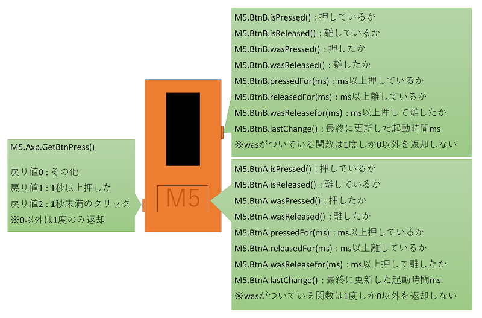

# ボタン管理(Button)

## 概要

ボタンの状態管理用クラス。電源ボタンはこのクラスの管理外だが、同じボタンなので記述してあります。



## Doxygenドキュメント

- [Button クラス](https://lang-ship.com/reference/M5StickC/latest/class_button.html)

## メンバー

###  Button()

```c
Button::Button(uint8_t pin, uint8_t invert, uint32_t dbTime)
```


### ボタンの状態更新 read()
ボタンの状態を更新する。この関数を呼び出さないとボタンの状態は更新されない。ただし個別に呼び出すのではなく、M5.update()で一括して状態を更新する。
```c
uint8_t Button::read()
```

!!! note "戻り値"
	1:現在ボタンが押されている, 0:その他の状態

!!! Tip "利用例"
	```c
	void loop() {
	 M5.update();
	} 
	```


### 現在ボタンが押されているか取得 isPressed()
現在ボタンが押されているかを取得する。1の状態が続く限り1を返却する。
```c
uint8_t Button::isPressed()
```

!!! note "戻り値"
	uint8_t 1:現在ボタンが押されている, 0:その他の状態

!!! Tip "利用例"
	```c
	int btnA = M5.BtnA.isPressed(); // ホームボタン
	int btnB = M5.BtnB.isPressed(); // 右ボタン 
	```


### 現在ボタンが押されていないか取得 isReleased()
現在ボタンが押されていないかを取得する。1の状態が続く限り1を返却する。
```c
uint8_t Button::isReleased()
```

!!! note "戻り値"
	1:現在ボタンが押されていない, 0:その他の状態

!!! Tip "利用例"
	```c
	int btnA = M5.BtnA.isReleased(); // ホームボタン
	int btnB = M5.BtnB.isReleased(); // 右ボタン 
	```


### ボタンが押されたか取得 wasPressed()
ボタンが押されてから最初に呼び出した時だけ1を返却。状態が変更していない場合2度目からは0を返却する。
```c
uint8_t Button::wasPressed()
```

!!! note "戻り値"
	1:ボタンが押された, 0:その他の状態

!!! Tip "利用例"
	```c
	int btnA = M5.BtnA.wasPressed(); // ホームボタン
	int btnB = M5.BtnB.wasPressed(); // 右ボタン 
	```


### ボタンが離されたか取得 wasReleased()
ボタンが押して、離してから最初に呼び出した時だけ1を返却。状態が変更していない場合2度目からは0を返却する。 一般的なボタンを押した条件として利用する。
```c
uint8_t Button::wasReleased()
```

!!! note "戻り値"
	1:ボタンが押され離された, 0:その他の状態

!!! Tip "利用例"
	```c
	int btnA = M5.BtnA.wasReleased(); // ホームボタン
	int btnB = M5.BtnB.wasReleased(); // 右ボタン 
	```


### ボタンが一定時間以上押されたか取得 pressedFor()
ボタンが押されてからms以上経過したかを返却。1の状態が続く限り1を返却する。 長押し系の判定に利用する。
```c
uint8_t Button::pressedFor(uint32_t ms)
```

!!! summary "引数"
	- uint32_t `ms` ミリ秒単位での判定時間

!!! note "戻り値"
	1:ボタンがms以上押された, 0:その他の状態

!!! Tip "利用例"
	```c
	int btnA = M5.BtnA.pressedFor(1000); // ホームボタン
	int btnB = M5.BtnB.pressedFor(1000); // 右ボタン 
	```


### ボタンを離してから一定時間以上経過したか取得 releasedFor()
ボタンが離されてからms以上経過したかを返却。1の状態が続く限り1を返却する。 連打防止などで一定時間経過後にフラグリセットなどを行う場合に利用する。
```c
uint8_t Button::releasedFor(uint32_t ms)
```

!!! summary "引数"
	- uint32_t `ms` ミリ秒単位での判定時間

!!! note "戻り値"
	1:ボタンを離してからms以上経過した, 0:その他の状態

!!! Tip "利用例"
	```c
	int btnA = M5.BtnA.releasedFor(1000); // ホームボタン
	int btnB = M5.BtnB.releasedFor(1000); // 右ボタン 
	```


### ボタンを離してから一定時間以上経過したか取得 wasReleasefor()
ボタンをms以上押してから、離して最初に呼び出した時だけ1を返却。状態が変更していない場合2度目からは0を返却する。 非常に短い時間を指定するとチャタリング防止的に利用可能。1秒以上を指定すると長押しの判定に利用できる。
```c
uint8_t Button::wasReleasefor(uint32_t ms)
```

!!! summary "引数"
	- uint32_t `ms` ミリ秒単位での判定時間

!!! note "戻り値"
	1:ms以上ボタンを押してから離した, 0:その他の状態

!!! Tip "利用例"
	```c
	int btnA = M5.BtnA.wasReleasefor(1000); // ホームボタン
	int btnB = M5.BtnB.wasReleasefor(1000); // 右ボタン 
	```


### ボタンが最後に状態変更した時間取得 lastChange()
最後にボタンの状態が変更された時の millis() の値を返却。現在のmillis()からの差分が経過時間になります。
```c
uint32_t Button::lastChange()
```

!!! note "戻り値"
	最後にボタンの状態が変更された時の millis() の値

!!! Tip "利用例"
	```c
	int btnA = M5.BtnA.lastChange(); // ホームボタン
	int btnB = M5.BtnB.lastChange(); // 右ボタン 
	```


## サンプルスケッチ [[Github](https://github.com/tanakamasayuki/M5StickC-examples/blob/master/ButtonTest/ButtonTest.ino)]
```
#include <M5StickC.h>

void setup() {
  M5.begin();
  M5.Lcd.setRotation(3); // 画面に入らないので横向きにする
}

void loop() {
  // Buttonクラスを利用するときには必ずUpdateを呼んで状態を更新する
  M5.update();

  // カーソル初期化
  M5.Lcd.setCursor(0, 0);

  // ホームボタンが現在押されているか？
  M5.Lcd.print("BtnA.isPressed():");
  M5.Lcd.println( M5.BtnA.isPressed() );

  // ホームボタンが現在離しているか？
  M5.Lcd.print("BtnA.isReleased():");
  M5.Lcd.println( M5.BtnA.isReleased() );

  // ホームボタンを押したか？（1度だけ取得可能）
  if ( M5.BtnA.wasPressed() ) {
    Serial.println("BtnA.wasPressed() == TRUE");
  }

  // ホームボタンを離したか？（1度だけ取得可能）
  if ( M5.BtnA.wasReleased() ) {
    Serial.println("BtnA.wasReleased() == TRUE");
  }

  // ホームボタンを現在ms以上押しているか？
  if ( M5.BtnA.pressedFor(1000) ) {
    Serial.println("BtnA.pressedFor(1000) == TRUE");
  }

  // ホームボタンを離してからms以上経過しているか？
  M5.Lcd.print("BtnA.releasedFor(1000):");
  M5.Lcd.println( M5.BtnA.releasedFor(1000) );

  // ホームボタンをms以上押してから離したか？（1度だけ取得可能）
  if ( M5.BtnA.wasReleasefor(1000) ) {
    Serial.println("BtnA.wasReleasefor(1000) == TRUE");
  }

  // ホームボタンが最後に更新した起動経過時間 millis()
  M5.Lcd.print("BtnA.lastChange():");
  M5.Lcd.println( M5.BtnA.lastChange() );

  // 空行を追加
  M5.Lcd.println();

  // 右ボタンが現在押されているか？
  M5.Lcd.print("BtnB.isPressed():");
  M5.Lcd.println( M5.BtnB.isPressed() );

  // 右ボタンが現在離しているか？
  M5.Lcd.print("BtnB.isReleased():");
  M5.Lcd.println( M5.BtnB.isReleased() );

  // 右ボタンを押したか？（1度だけ取得可能）
  if ( M5.BtnB.wasPressed() ) {
    Serial.println("BtnB.wasPressed() == TRUE");
  }

  // 右ボタンを離したか？（1度だけ取得可能）
  if ( M5.BtnB.wasReleased() ) {
    Serial.println("BtnB.wasReleased() == TRUE");
  }

  // 右ボタンを現在ms以上押しているか？
  if ( M5.BtnB.pressedFor(1000) ) {
    Serial.println("BtnB.pressedFor(1000) == TRUE");
  }

  // 右ボタンを離してからms以上経過しているか？
  M5.Lcd.print("BtnB.releasedFor(1000):");
  M5.Lcd.println( M5.BtnB.releasedFor(1000) );

  // 右ボタンをms以上押してから離したか？（1度だけ取得可能）
  if ( M5.BtnB.wasReleasefor(1000) ) {
    Serial.println("BtnB.wasReleasefor(1000) == TRUE");
  }

  // 右ボタンが最後に更新した起動経過時間 millis()
  M5.Lcd.print("BtnB.lastChange():");
  M5.Lcd.println( M5.BtnB.lastChange() );

  // 電源ボタンの状態取得（一度しか0以外のステータスは取得できない）
  int axpButton = M5.Axp.GetBtnPress();
  if ( axpButton == 1 ) {
    // 1秒以上電源ボタンを押している
    Serial.println("M5.Axp.GetBtnPress() == 1");
  }
  if ( axpButton == 2 ) {
    // 1秒未満電源ボタンを押して離した
    Serial.println("M5.Axp.GetBtnPress() == 2");
  }
}
```

## 関連ブログ

- [M5StickCのButtonクラスを調べてみた](https://lang-ship.com/blog/?p=699)
