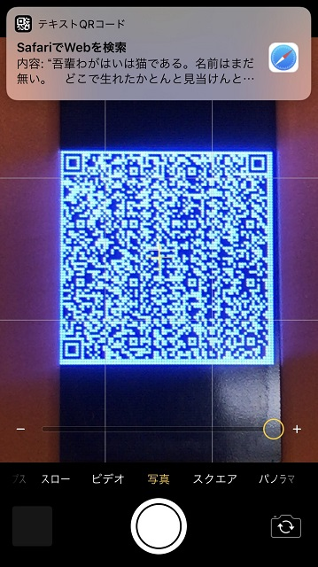
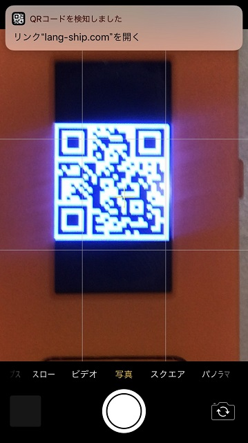
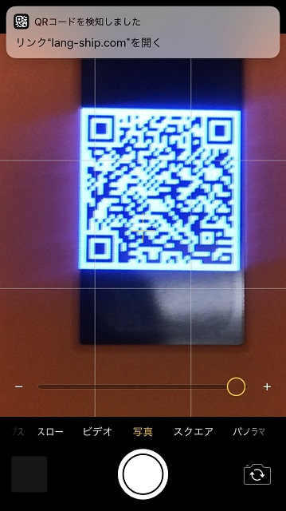

# QRコード(QRCode)

## 概要

QRコードを表示する機能ですが、構造体と実関数だけあって、実際の呼び出しはM5Displayクラスにてラッピングされています。

利用した文字数に応じて2(32バイト)、5(106バイト)、15(520バイト)のバージョンを選択して、大きさはなるべく80で表示する。

ただし、QRコードの仕様的には周囲にマージンが必要ですので、少し小さめに出したほうが仕様的には正しいです。



## Doxygenドキュメント

- [QRCode 構造体](https://lang-ship.com/reference/M5StickC/latest/struct_q_r_code.html)

## 関数リファレンス

### QRコード表示 qrcode()

QRコードを表示する。stringがchar型とString型がある。

!!! note "定義"
	void M5Display::qrcode(  
	&nbsp;	const char * 	string,  // 文字列  
	&nbsp;	uint16_t 	x = 5,  	 // 表示座標  
	&nbsp;	uint16_t 	y = 45,  	 // 表示座標  
	&nbsp;	uint8_t 	width = 70,  // 横幅  
	&nbsp;	uint8_t 	version = 7  // QRコードバージョン  
	)

!!! note "定義"
	void M5Display::qrcode(  
	&nbsp;	const String & 	string,  // 文字列  
	&nbsp;	uint16_t 	x = 5,  	 // 表示座標  
	&nbsp;	uint16_t 	y = 45,  	 // 表示座標  
	&nbsp;	uint8_t 	width = 70,  // 横幅  
	&nbsp;	uint8_t 	version = 7  // QRコードバージョン  
	)


## サンプルスケッチ
```
#include <M5StickC.h>
 
void setup() {
  M5.begin();
 
  M5.Lcd.qrcode("https://lang-ship.com/reference/", 0, 45, 80, 5);
}
 
void loop() {
}
```

## バージョンについて

バージョン15が限界のサイズで、小さくなるほど情報が少なくなりますが、認識しやすくなります。

M5StickCの場合には横幅80までなので、下記以外のバージョンを使うメリットはないと思います。

### バージョン2

32バイトまでの短いデータを3倍に拡大したQRコードで表示する。

```
  M5.Lcd.qrcode("https://lang-ship.com/reference/", 0, 45, 80, 2);
```



### バージョン5

106バイトまでのデータを2倍に拡大したQRコードで表示する。

```
  M5.Lcd.qrcode("https://lang-ship.com/reference/M5StickC/0.0.7/class_m5_display.html#afcf56c004682faa0a4d003f7d327b93b", 0, 45, 80, 5 );
```



### バージョン15

520バイトまでのデータをQRコードで表示する。

```
  M5.Lcd.qrcode("吾輩わがはいは猫である。名前はまだ無い。　どこで生れたかとんと見当けんとうがつかぬ。何でも薄暗いじめじめした所でニャーニャー泣いていた事だけは記憶している。吾輩はここで始めて人間というものを見た。しかもあとで聞くとそれは書生という人間中で一番獰悪どうあくな種族であったそうだ。この書生というのは時々我々を捕つかまえて煮にて食うという話である。",
    0, 45, 80, 15);
```


## 関連ブログ

- [M5StickCのQRCodeを調べてみた](https://lang-ship.com/blog/?p=717)
