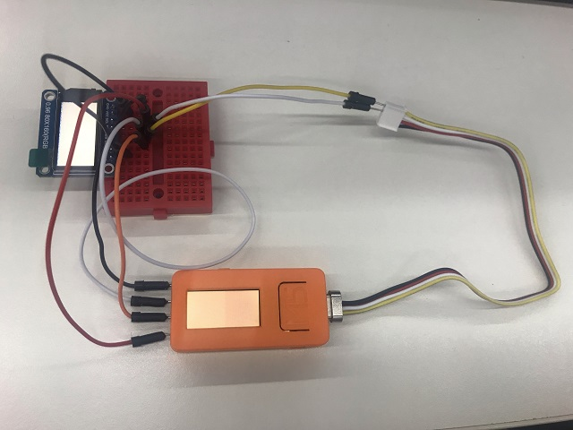

# ST7735S+ISP液晶

M5StickCに内蔵されているのと、同じスペックのISP液晶を、外部接続してみました。

## デバイス

<iframe style="width:120px;height:240px;" marginwidth="0" marginheight="0" scrolling="no" frameborder="0" src="https://rcm-fe.amazon-adsystem.com/e/cm?ref=qf_sp_asin_til&t=langship-22&m=amazon&o=9&p=8&l=as1&IS2=1&detail=1&asins=B07S728JV4&linkId=e239a6d3b83e707db8ed63de0e71ff20&bc1=000000&lt1=_blank&fc1=333333&lc1=0066c0&bg1=ffffff&f=ifr"></iframe>

上記のデバイスを利用しました。

## 接続例
| ST7735 | 接続先 | 内容               |
|--------|--------|--------------------|
| GND    | GND    | 共通GND            |
| VCC    | 3V3    | 電源               |
| SCL    | 0      | SCK                |
| SDA    | 32     | MOSI               |
| RES    | 33     | リセット           |
| DC     | 26     | MISO               |
| CS     | GND    | このデバイスを選択 |
| BLK    | 未接続 | バックライト制御   |

CSはGNDに接続して、常にこのデバイスを選択している状態にしています。

バックライトはGNDに接続すると消える設定でした。

SPIの信号線の他に、リセット端子への接続が必要になったので、4線すべてを使う形となりました。



## 商品情報
- [商品ページ](http://www.sitronix.com.tw/en/product/Driver/mobile_display.html)
- [データシート](https://github.com/m5stack/M5-Schematic/blob/master/Core/ST7735S_v1.1.pdf)

※ オフィシャルのデータシートが無いのでM5StickCと同じもの。インターネット上だと[1.3](https://www.crystalfontz.com/controllers/Sitronix/ST7735S/)も存在しています

## 必須ライブラリ
- Adafruit ST7735
- Adafruit GFX

## サンプルスケッチ
```
#include <M5StickC.h>
#include <Adafruit_GFX.h>
#include <Adafruit_ST7735.h>
#include <SPI.h>
 
Adafruit_ST7735 tft = Adafruit_ST7735(-1, 0, 26, 32, 33); // cs, dc, mosi, sclk, rst
 
uint16_t color = 0;
 
void setup() {
  M5.begin();
 
  tft.initR(INITR_MINI160x80);
}
 
void loop() {
  tft.fillScreen(color);
  M5.Lcd.fillScreen(color);
  color += 0x0100;
}
```

最低限のコードだけに削っているものになります。AdafruitとM5StickCでcolorの型が違うので、違う色が表示されますが、画面の色が塗り替わっているまでは確認できました。

SPIの転送速度がAdafruitと内蔵eSPIクラスでは違うので、ちょっぴり描画時間に差がでています。

## 関連ブログ
- [M5StickCでSPI通信をする](https://lang-ship.com/blog/?p=683)
