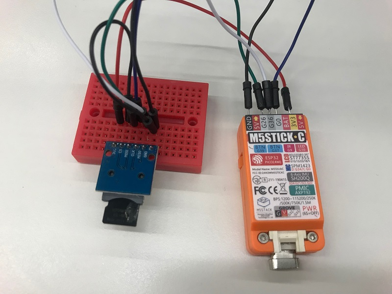

# SD

SPI接続のSDカードのみM5StickCでは利用が可能です。



## 利用デバイス

<iframe style="width:120px;height:240px;" marginwidth="0" marginheight="0" scrolling="no" frameborder="0" src="https://rcm-fe.amazon-adsystem.com/e/cm?ref=qf_sp_asin_til&amp;t=langship-22&amp;m=amazon&amp;o=9&amp;p=8&amp;l=as1&amp;IS2=1&amp;detail=1&amp;asins=B010GXAFFU&amp;linkId=203e2b9e020a56cb545079d3e91fed21&amp;bc1=000000&amp;lt1=_blank&amp;fc1=333333&amp;lc1=0066c0&amp;bg1=ffffff&amp;f=ifr"></iframe>
<iframe style="width:120px;height:240px;" marginwidth="0" marginheight="0" scrolling="no" frameborder="0" src="https://rcm-fe.amazon-adsystem.com/e/cm?ref=tf_til&amp;t=langship-22&amp;m=amazon&amp;o=9&amp;p=8&amp;l=as1&amp;IS2=1&amp;detail=1&amp;asins=B07MB9TS13&amp;linkId=6806ca8d71c96648daf265488b96fb07&amp;bc1=000000&amp;lt1=_blank&amp;fc1=333333&amp;lc1=0066c0&amp;bg1=ffffff&amp;f=ifr"></iframe>

SPI接続以外にもいろいろとSDカードリーダーがあるので、気をつけて選びましょう。

抵抗などの部品が一切搭載されていないブレイクアウト基板を使う場合には、信号線にプルアップなどが必要になるので注意しましょう。

## 接続
| M5StickC | SD   |
|----------|------|
| 3V3      | 3V3  |
| GND      | GND  |
| 0        | CLK  |
| 36       | MISO |
| 26       | MOSI |
| GND      | CS   |

M5StickC側はどのピンでもアサイン可能ですが、初期化時に若い番号から並ぶようにアサインしました。

ただし36は入力専用なので、入力用端子のMISOに設定します。

SDカードは3.3Vで動きますので、間違ってGROVE端子などの5Vを接続しないようにしましょう。

## サンプルスケッチ [[Github](https://github.com/tanakamasayuki/M5StickC-examples/blob/master/SPI_SD/SPI_SD.ino)]
```
#include <M5StickC.h>
#include "SD.h"

// PIN配置
enum { spi_sck = 0, spi_miso = 36, spi_mosi = 26, spi_ss = -1 };

void setup()
{
  // M5StickC初期化
  M5.begin();
  M5.Lcd.setRotation(3);

  // SPI初期化
  SPI.begin(spi_sck, spi_miso, spi_mosi, spi_ss);

  // SDカード初期化
  if (!SD.begin(spi_ss)) {
    M5.Lcd.println("Card Mount Failed");
    return;
  }

  // SDカード種別取得
  uint8_t cardType = SD.cardType();
  if (cardType == CARD_NONE) {
    M5.Lcd.println("None SD Card");
    return;
  }
  M5.Lcd.print("SD Card Type: ");
  if (cardType == CARD_MMC) {
    M5.Lcd.println("MMC");
  } else if (cardType == CARD_SD) {
    M5.Lcd.println("SDSC");
  } else if (cardType == CARD_SDHC) {
    M5.Lcd.println("SDHC");
  } else {
    M5.Lcd.println("UNKNOWN");
  }

  // SDカード容量取得
  uint64_t cardSize = SD.cardSize() / (1024 * 1024);
  M5.Lcd.printf("SD Card Size: %lluMB\n", cardSize);
}

void loop() {
}
```

SDカードをマウントしてから種別と容量を取得するだけのサンプルです。
