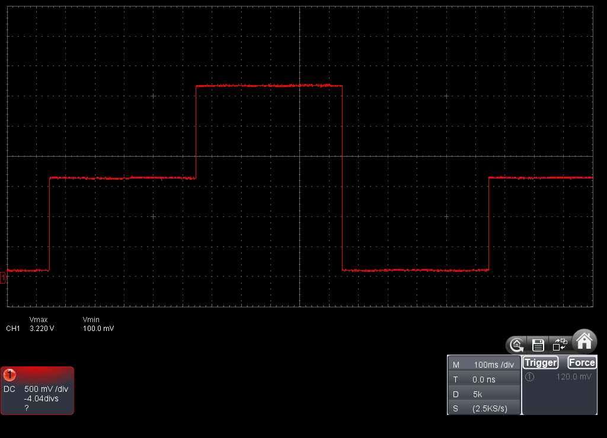

# DAC

## 概要

指定した電圧のアナログ出力を行う。出力をアンプにいれて増幅することで音楽などを鳴らすことが可能。安定した音楽再生の場合にはデータをバッファに入れてDMA転送を行う必要がある。

M5StickCでADCに使えるのはIO26の1つのみです。

| PIN            | IO26 | IO36 | IO0 | IO32 | IO33 |
|----------------|------|------|-----|------|------|
| dacWrite()     | ○    | NG   | NG  | NG   | NG   |

- IO26

## サンプルコード
```
#include <M5StickC.h>
 
int PIN = 26;
 
void setup() {
  M5.begin();
 
  pinMode(PIN, OUTPUT);
}
 
void loop() {
  dacWrite(PIN, 0);
  delay(500);
  dacWrite(PIN, 128);
  delay(500);
  dacWrite(PIN, 255);
  delay(500);
}
```



IO26からの出力にLEDと抵抗に接続してものをオシロスコープで測定した結果です。若干電圧低下していますが、概ね255で3.3V程度、128でその半分の電圧が出力されています。

## リファレンス
- [espressif](https://docs.espressif.com/projects/esp-idf/en/latest/api-reference/peripherals/dac.html)

## 関連ブログ

- [M5StickCのIOについて調べてみた](https://lang-ship.com/blog/?p=658)
