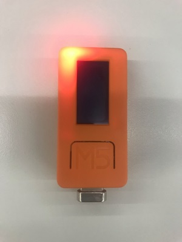

# 内蔵赤色LED

## 概要

M5StickCは赤色LEDを内蔵しており、点灯させることができます。

## サンプルコード
```
#include <M5StickC.h>
 
void setup(){
  M5.begin();
 
  // LED ON(GPIO_NUM_10 or M5_LED)
  pinMode(GPIO_NUM_10, OUTPUT);
  digitalWrite(GPIO_NUM_10, LOW);
}
 
void loop() {
}
```

M5StickCのPIN10にLEDが接続されていますが、PINからの出力電圧で点灯させるのではありません。
バッテリーから電源が供給されており、GPIO10をLOWに設定することで電流が流れ点灯します。




## 関連ブログ

- [M5StickCの内蔵LEDを使う](https://lang-ship.com/blog/?p=817)
