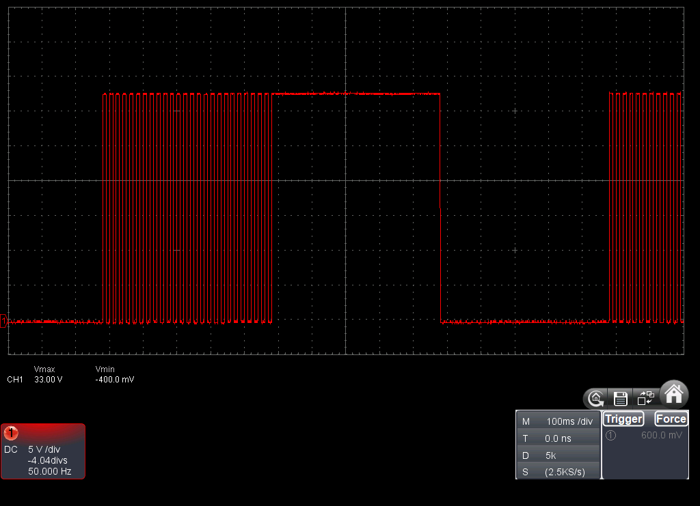

# PWM(LED Control)

## 概要

3.3V出力をON/OFFすることで擬似的に出力を制御するPWMを利用することができます。

| PIN            | IO26 | IO36 | IO0 | IO32 | IO33 |
|----------------|------|------|-----|------|------|
| ledcWrite()    | ○    | NG   | ○   | ○    | ○    |

## サンプルコード
```
#include <M5StickC.h>
 
int PIN = 32;
int PWMCH = 0;
 
void setup() {
  M5.begin();
 
  pinMode(PIN, OUTPUT);
  ledcSetup(PWMCH, 12000, 8);
  ledcAttachPin(PIN, PWMCH);
}
 
void loop() {
  ledcWrite(PWMCH, 0);    //   0%(0.0V)
  delay(500);
  ledcWrite(PWMCH, 128);  //  50%(1.7V)
  delay(500);
  ledcWrite(PWMCH, 256);  // 100%(3.3V)
  delay(500);
}
```

PWMは4PIN同時に利用することが可能で、細かい設定はledcSetup()で行っています。サンプルは周波数が 12KHz で分解能が8ビット(0-256)になっています。



上記はキャプチャ用に周波数50Hzに落として実験しましたが、上記のように128(50%)を指定するとONとOFFが交互にきて、平均すると半分の電圧相当になります。

## 関数リファレンス

- [Functions/esp32-hal-ledc](../../Functions/esp32-hal-ledc/)

## リファレンス
- [espressif](https://docs.espressif.com/projects/esp-idf/en/latest/api-reference/peripherals/ledc.html)

## 関連ブログ

- [M5StickCのIOについて調べてみた](https://lang-ship.com/blog/?p=658)
- [ESP32のPWM出力は255が最大じゃなかった](https://lang-ship.com/blog/?p=667)
