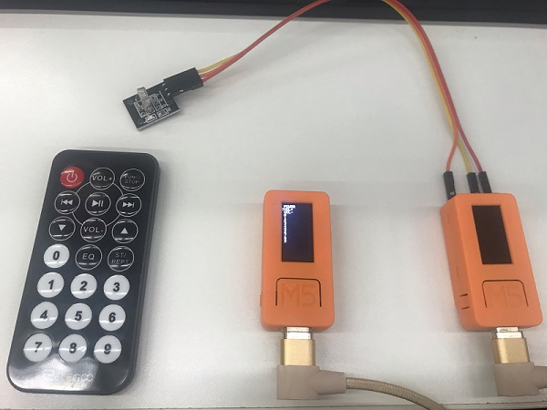
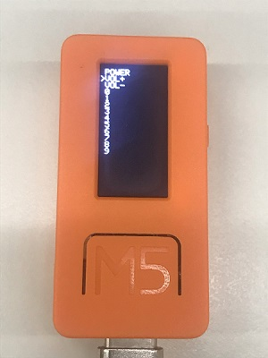

# 赤外線送受信(Remote Control)

## 概要

赤外線リモコンを送受信するための機能です。送信用赤外線は内蔵しているので、そのまま使うことができますが、受信は赤外線センサーを追加で接続する必要があります。

## おすすめライブラリ(IRremoteESP8266)

- [GitHubオフィシャルページ](https://github.com/crankyoldgit/IRremoteESP8266)
- [Doxygen(非公式自動生成ドキュメント)](https://lang-ship.com/reference/Arduino/libraries/IRremoteESP8266/)

IRremoteESP8266はArduinoの標準ライブラリからインポートして利用することができるライブラリで、IRremoteという有名な赤外線リモコンのライブラリをESP8266とESP32に特化した形でフォークしたものです。

元になったIRremoteは受信しかできませんが、IRremoteESP8266を利用することで送信も可能です。

## 検証環境



検証環境は[ELEGOO Arduino用スターターキット](https://amzn.to/2HYmqia)に付属しているリモコンと赤外線センサーを利用しています。

赤外線センサーは以下の端子に接続しています。DATA端子は26の他に0、36、32、33の端子が利用できます。

電源はセンサー自体は5Vでも動きますが、戻りの信号のHIGHが5Vになってしまうので3.3Vに接続しています。

| 赤外線センサー | M5StickC |
|----------------|----------|
| G(GND)         | GND      |
| R(VCC)         | 3V3      |
| Y(DATA)        | GPIO26   |

## 受信側

受信側はIRremoteESP8266のサンプルスケッチであるIRrecvDumpV2を利用すると簡単に分析が可能です。

受信ユニットを接続したPINの番号を変更するだけで動きました。

## 送信側 ([GitHub](https://github.com/tanakamasayuki/M5StickC-examples/blob/master/IRNecSend/IRNecSend.ino))

```c
#include <M5StickC.h>
#include <IRremoteESP8266.h>
#include <IRsend.h>
#include <IRutils.h>
 
const uint16_t kIrLed = 9;              // M5StickCはGPIO9にIRが内蔵
 
IRsend irsend(kIrLed);                  // IR送信を宣言
 
const uint32_t CUSTOMER_CODE = 0x00ff;  // カスタマーコードをセット
 
// リモコンコード保存用構造体
struct REMOTE {
  char name[9];
  uint8_t command;
};
 
// リモコンコード一覧
REMOTE remote[] = {
  { "POWER" , 0x45 },
  { "VOL+"  , 0x46 },
  { "VOL-"  , 0x15 },
  { "0"     , 0x16 },
  { "1"     , 0x0c },
  { "2"     , 0x18 },
  { "3"     , 0x5e },
  { "4"     , 0x08 },
  { "5"     , 0x1c },
  { "6"     , 0x5a },
  { "7"     , 0x42 },
  { "8"     , 0x52 },
  { "9"     , 0x4a },
};
 
int cursor = 0; // カーソル位置
 
void setup() {
  M5.begin();     // M5StickC初期化
  irsend.begin(); // IR初期化
 
  // リモコン項目表示
  M5.Lcd.fillScreen(BLACK);
  M5.Lcd.setCursor(0, 8);
  for ( int i = 0 ; i < ( sizeof(remote) / sizeof(REMOTE) ) ; i++ ) {
    M5.Lcd.print((cursor == i) ? ">" : " ");
    M5.Lcd.println(remote[i].name);
  }
}
 
void loop() {
  M5.update();  // ボタン状態更新
 
  // M5ボタンで送信
  if ( M5.BtnA.wasPressed() ) {
    // 送信4Byte(カスタマーコード2Byte+リモコンコード+反転リモコンコード)
    uint64_t send = 0;
    send = (uint64_t)reverseBits(CUSTOMER_CODE >> 8, 8) << 24;    // カスタマーコード(上位8bit)
    send += (uint64_t)reverseBits(CUSTOMER_CODE &amp; 0xff, 8) << 16; // カスタマーコード(下位8bit)
    send += reverseBits(remote[cursor].command, 8) << 8;          // リモコンコードを順番入れ替えて送信
    send += reverseBits(remote[cursor].command, 8) ^ 0xff;        // リモコンコードのビット反転（パリティ）
    irsend.sendNEC(send);                                         // 送信
 
    // デバッグ表示
    Serial.printf("Send IR : 0x%08LX", send);
    Serial.printf("(customer=0x%04X, ", CUSTOMER_CODE);
    Serial.printf("command=0x%02X)\n", remote[cursor].command);
  }
 
  // 右ボタンでカーソル移動
  if ( M5.BtnB.wasPressed() ) {
    cursor++;
    cursor = cursor % ( sizeof(remote) / sizeof(REMOTE) );
 
    // カーソル描画
    M5.Lcd.setCursor(0, 8);
    for ( int i = 0 ; i < ( sizeof(remote) / sizeof(REMOTE) ) ; i++ ) {
      M5.Lcd.println((cursor == i) ? ">" : " ");
    }
  }
 
  delay(100);
}
```

上記を実行するとリモコンの一覧がでてきて、右ボタン(Bボタン)でカーソルが動き、下ボタン(Aボタン)で送信をします。



IRremoteESP8266のサンプルスケッチであるIRsendDemoのPINを9に変更してまずは動かしたほうがわかりやすいと思いますが、PIN番号を指定して宣言すればあとは実際に送信するコードを指定するだけで動きます。

赤外線リモコンのコードは会社によって複数フォーマットがあり、今回は一番有名なNECフォーマットで送信しています。

NECフォーマットの特徴としては2バイトのカスタマーコード(会社)があり、ここで自分が利用するコード以外が来たら無視する設定になっています。
その後に送信するリモコンコードと、そのコードを反転したパリティの4バイトを送るのですが、ビットの並びが下位から上位の順番なのでreverseBits()関数を利用して順番を入れ替えています。

```
Send IR : 0x00FFA25D(customer=0x00FF, command=0x45)
```

上記が0x45(POWERボタン)のコードを送ったときのデータですが、ビットの並びが違うので、実際に送信されたデータを見ただけだとすぐに解析ができません。

実際に利用する場合には、実物のリモコンが送信している0x00FFA25DをPOWERボタンとしてデータ保持しているほうがシンプルなコードになります。

## シンプル送信側コード ([GitHub](https://github.com/tanakamasayuki/M5StickC-examples/blob/master/IRNecSend2/IRNecSend2.ino))

```c
#include <M5StickC.h>
#include <IRremoteESP8266.h>
#include <IRsend.h>
 
const uint16_t kIrLed = 9;              // M5StickCはGPIO9にIRが内蔵
 
IRsend irsend(kIrLed);                  // IR送信を宣言
 
// リモコンコード保存用構造体
struct REMOTE {
  char name[9];
  uint64_t command;
};
 
// リモコンコード一覧
REMOTE remote[] = {
  { "POWER" , 0x00FFA25DUL },
  { "VOL+"  , 0x00FF629DUL },
  { "VOL-"  , 0x00FFA857UL },
  { "0"     , 0x00FF6897UL },
  { "1"     , 0x00FF30CFUL },
  { "2"     , 0x00FF18E7UL },
  { "3"     , 0x00FF7A85UL },
  { "4"     , 0x00FF10EFUL },
  { "5"     , 0x00FF38C7UL },
  { "6"     , 0x00FF5AA5UL },
  { "7"     , 0x00FF42BDUL },
  { "8"     , 0x00FF4AB5UL },
  { "9"     , 0x00FF52ADUL },
};
 
int cursor = 0; // カーソル位置
 
void setup() {
  M5.begin();     // M5StickC初期化
  irsend.begin(); // IR初期化
 
  // リモコン項目表示
  M5.Lcd.fillScreen(BLACK);
  M5.Lcd.setCursor(0, 8);
  for ( int i = 0 ; i < ( sizeof(remote) / sizeof(REMOTE) ) ; i++ ) {
    M5.Lcd.print((cursor == i) ? ">" : " ");
    M5.Lcd.println(remote[i].name);
  }
}
 
void loop() {
  M5.update();  // ボタン状態更新
 
  // M5ボタンで送信
  if ( M5.BtnA.wasPressed() ) {
    // 送信4Byte(カスタマーコード2Byte+リモコンコード+反転リモコンコード)
    irsend.sendNEC(remote[cursor].command);
 
    // デバッグ表示
    Serial.printf("Send IR : 0x%08LX", remote[cursor].command);
  }
 
  // 右ボタンでカーソル移動
  if ( M5.BtnB.wasPressed() ) {
    cursor++;
    cursor = cursor % ( sizeof(remote) / sizeof(REMOTE) );
 
    // カーソル描画
    M5.Lcd.setCursor(0, 8);
    for ( int i = 0 ; i < ( sizeof(remote) / sizeof(REMOTE) ) ; i++ ) {
      M5.Lcd.println((cursor == i) ? ">" : " ");
    }
  }
 
  delay(100);
}
```

実物のリモコンが手元にある場合には、受信して確認したデータをそのまま送信したほうが楽だと思います。ネット上で送信データを調べた場合には内部的な数値なのか、送信時のデータなのかを確認してから利用してください。

## リファレンス
- [espressif](https://docs.espressif.com/projects/esp-idf/en/latest/api-reference/peripherals/rmt.html)

## 関連ブログ

- [M5StickCで赤外線リモコンを使う](https://lang-ship.com/blog/?p=886)
- [M5StickC(ESP32)の赤外線(RMT)受信を調べた](https://lang-ship.com/blog/?p=732)

