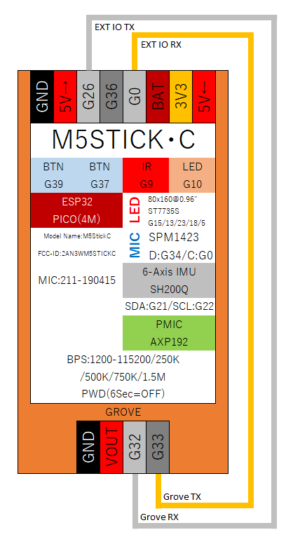

# シリアル通信(UART)

## 概要

シリアル通信をするための機能です。

送信と受信の通信線をクロスにつないだ通信方式です。2本の通信線で通信ができるので簡単ですが、フロー制御などがないので文字化けとか通信データの欠落などがでてきます。

ESP32では3系統のUARTが利用することができます。

- Serial : USB接続した場合にPCと通信するシリアル
- Serial1 : 2系統目のシリアル
- Serial2 : 3系統目のシリアル

1系統目はPCとの接続に利用しています。2系統目と3系統目はどちらを使ってもいいですし、両方同時に使うことも可能です。

また、Bluetooth経由でワイヤレス接続のBluetoothSerialもあります。

## ピン配置

入力専用のIO36を除き、外部接続可能な4PINはどんな組み合わせでもI2Cで通信が可能です。

- Serial1 : RX(0), TX(26)
- Serial2 : RX(32), TX(33)

例として上記のように利用します。

## サンプル配線図



M5StickCのみで実験をする場合の配線です。特徴としてはRXとTXを接続することです。RXがReciverで受信、TXはTransmitterで送信を意味しています。

Groveは32, 33の順で割り当てるのが標準ですが、EXT IOの0と26は逆でも構いませんが、I2Cと同じように若い番号から割り当てています。

## サンプルスケッチ
```
#include <M5StickC.h>
 
void setup() {
  M5.begin();
 
  Serial1.begin(115200, SERIAL_8N1, 0, 26); // EXT_IO
  Serial2.begin(115200, SERIAL_8N1, 32, 33);// Grove
}
 
void loop() {
  if (Serial.available()) {
    // Serial(PC) to Serial1(EXT_IO)
    int inByte = Serial.read();
    Serial1.write(inByte);
  }
  if (Serial1.available()) {
    // Serial1(EXT_IO) to Serial2(Grove)
    int inByte = Serial1.read();
    Serial2.write(inByte);
  }
  if (Serial2.available()) {
    // Serial2(Grove) to Serial(PC)
    int inByte = Serial2.read();
    Serial.write(inByte);
  }
}
```

Arduinoのシリアルモニタから送信したデータをSerial(USB)で受信して、Serial1(EXT_IO)に出力。
Serial1(EXT_IO)で受信したデータをSerial2(Grove)に送信。
Serial2(Grove)で受信したデータをSerial(USB)に送信というサンプルです。

## 通信速度について

サンプルは一番最速の「115200」を指定していますが、速度が早いとエラーになる可能性があがるので、もう少し遅い速度を指定したほうが安定すると思います。

- 300
- 1200
- 2400
- 4800
- 9600
- 14400
- 19200
- 28800
- 38400
- 57600
- 115200

上記が指定できますが、相手と同じ速度を指定する必要があるので、相手が固定値だと選択肢がないです。
速度が必要ない場合には9600あたりか、少し早い19200あたりの方がエラーは少ないです。

遅めで通信をして、速度が必要になった場合に早くするほうが無難です。

## 外部装置との接続例

ESP32の開発ボードとM5StickCをUARTで接続する実験をしてみました。

### M5StickC側サンプルスケッチ
```
#include <M5StickC.h>
 
void setup() {
  M5.begin();
 
  Serial2.begin(115200, SERIAL_8N1, 32, 33);
}
 
void loop() {
  if (Serial2.available()) {
    int inByte = Serial2.read();
    Serial.write(inByte);
  }
 
  if (Serial.available()) {
    int inByte = Serial.read();
    Serial2.write(inByte);
  }
}
```

Grove側の32と33を使って接続しています。
ESP32から送信されたデータをSerial2(Grove)で受信して、Serial(USB)に送信しています。
また、Serial(USB)から送信されたデータをSerial2(Grove)に送信しています。

### ESP32開発ボード側サンプルスケッチ
```
void setup() {
  Serial.begin(115200);  
  Serial2.begin(115200, SERIAL_8N1, 32, 33);
}
 
void loop() {
  if (Serial2.available()) {
    int inByte = Serial2.read();
    Serial.write(inByte);
  }
 
  if (Serial.available()) {
    int inByte = Serial.read();
    Serial2.write(inByte);
  }
}
```

ほぼ一緒ですが、M5.begin()の中で実行されているSerial.begin()を自分で呼び出す必要があります。

### 実行の注意点

Arduino IDEのシリアルモニタは1つのシリアルしか開けません。
開発ボードを変更すると他の設定も一度に変わってしまうので、別のパソコンとかに繋げて実験するのが一番動かしやすいです。

## UARTの注意点

### 電圧差異
M5StickCは内部は3.3Vで動いていますが、一般的なArduinoボードは5Vで動いています。そのまま接続すると電圧が異なりますので、繋げないほうがいいです。

M5StickCは実際には5V信号を入力しても、壊れない気がしますがデータシート上は5Vは許容していませんので、電圧変換の回路やICを間にいれて接続する必要があります。

物によっては12Vとかを流してくるシリアルもあるので、安易に繋ぐのはやめましょう。

### 速度差異
お互いに同じ速度を設定しないと通信ができません。複数機材を接続するのであれば、お互いに同じ値を設定するればよいのですが、LTEモジュールなどの通信機器と接続するためには、相手側の初期値で接続してから、変更するなどをする必要があるので注意しましょう。

### エラー処理
基本的に1バイト単位で送受信する機能しかありませんので、途中でエラーが発生したり、相手側が受信を失敗しているかを確認する方法が標準では提供されていません。

エラー処理は自分で考慮する必要があるので注意して使ってください。

## まとめ
UART自体は簡単に利用することができます。ただし長い距離を通信させることや、高速で通信する場合にはエラー処理などがちょっと不安ですので、注意が必要そうです。

パソコンと接続するのであればBluetoothSerialを使うことで、速度とエラー処理などの心配がほぼ無くなるのでおすすめです。

## リファレンス
- [espressif](https://docs.espressif.com/projects/esp-idf/en/latest/api-reference/peripherals/uart.html)

## 関連ブログ

- [M5StickCでUART(Serial)を使う](https://lang-ship.com/blog/?p=678)
