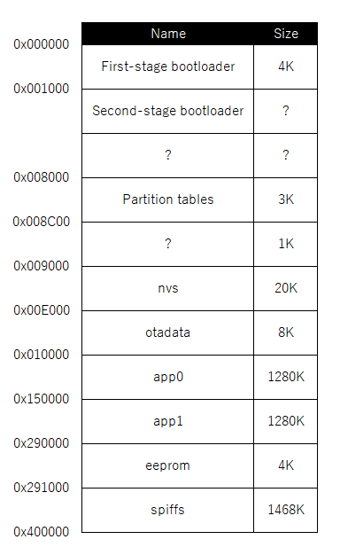
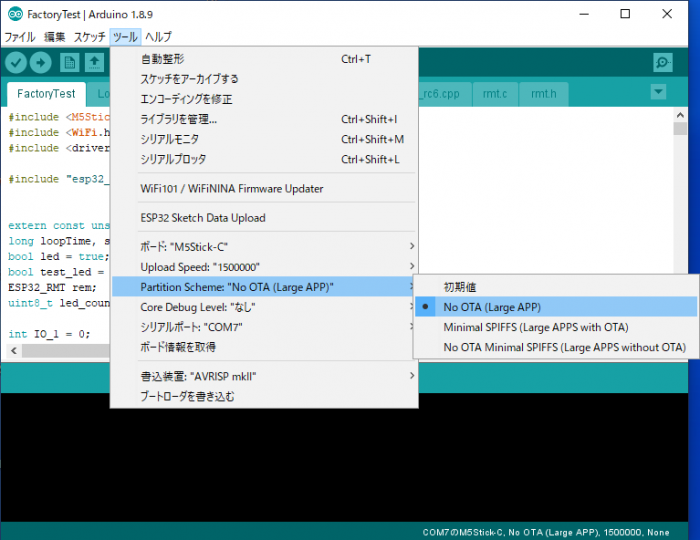

# Partition Table

M5StickCでは4Mのフラッシュメモリが搭載されており、用途に応じて容量を割り振る必要があります。

## メモリマップ



これは[Espressif](https://docs.espressif.com/projects/esp-idf/en/latest/api-guides/general-notes.html#application-memory-layout)の情報を元に作成した、標準的なメモリマップです。

First-stage bootloaderが最初に起動して、Second-stage bootloaderをメモリに展開して、Second-stage bootloaderを実行します。

その後Partition tablesを見て、app0からプログラムをロードして実行するのが通常の流れですが、ここは変更しないところなので、知らなくても大丈夫です。

## Arduino IDEでPartition Tablesの指定方法



上記のメニューから、初期値、No OTA、Minimal SPIFFSが選択できるのが標準の状態で、自分で作成することで、「No OTA Minimal SPIFFS」などの自分専用の設定を追加することができます。

## Arduino IDEで指定できるPartition Tables
| Name    | default   | No OTA    | Minimal SPIFFS |
|---------|----------:|----------:|---------------:|
| nvs     |    20,480 |    20,480 |         20,480 |
| otadata |     8,192 |     8,192 |          8,192 |
| app0    | 1,310,720 | 2,097,152 |      1,966,080 |
| app1    | 1,310,720 |         0 |      1,966,080 |
| spiffs  | 1,507,328 | 2,031,616 |        196,608 |

上記が標準で入っている設定値です。

No OTAでは、OTAを使わないのでapp1の領域を減らして、他に割り振っています。

Minimal SPIFFSでは、spiffsを減らして、アプリの領域を増やしています。

## Partition解説

### nvs(Non-volatile storage)

不揮発性ストレージで、電源を切っても保存される領域です。nvs_get_blob()関数などにより、名前をつけた値を保存することができます。ここのサイズはあまり変更しないようです。

Wi-Fiのアクセスポイントを保存するときとかに利用したりします。ただし、暗号化されていないのと、中身を取り出すことができるので、パスワードなどを保存して置くと、抜き出される可能性があります。

### otadata

OTA(Over The Air)はWi-Fi経由でプログラムを更新する仕組みで、そのためのプログラムが入っている領域です。OTAを利用しない場合でも、この領域は必要で、固定サイズになります。

### app0

実際のプログラムが入っている領域です。プログラムの領域が足りなくなった場合には、他の領域を減らして、ここの領域を増やすことができます。

通常は暗号化されていませんが、暗号化することも可能ですがちょっと複雑です。

### app1

OTAを利用する場合には、app0とapp1の交互にプログラムを書き込んでいき、書き込みに失敗した場合でも、書き換え前のプログラムが残っている状態にします。

そのためapp0とapp1の大きさは同じにする必要があります。ただしOTAを利用しない場合には0で構いません。

### eeprom(Electrically Erasable Programmable Read-Only Memory)

**※ ESP 1.0.3にて廃止されましたので、NVSを利用してください。**

こちらもnvsと同じく不揮発性ストレージです。名前でアクセスする機能はなく、アドレス単位でのアクセスになります。構造体を使うことで簡単に複数の設定を保存したり、取得したいすることができます。

こちらも、通常は暗号化されていないのと、中身を取り出すことができるので、パスワードなどを保存して置くと、抜き出される可能性があります。

### spiffs(Serial Peripheral Interface Flash File System)

SPIバス経由で接続されている内部フラッシュを利用した、ファイルシステムです。

[ESP-WROOM-32(ESP32) SPIFFSアップローダープラグインの使い方](https://www.mgo-tec.com/blog-entry-spiffs-uploader-plugin-arduino-esp32.html)

上記を参考に、dataフォルダを作って、ESP32 Sketch Data Uploadを実行するとフォルダの中身をESP32に転送してくれます。

spiffsの利点として、一度転送すれば上書きされることがないので、プログラムの転送サイズが減ります。OTAなどを利用した場合、プログラム内部にデータを内蔵しておくとapp0とapp1で同じデータが存在するので、spiffsにデータを置くことで容量を有効に使うことができます。

欠点として、初期状態で転送ツールがセットアップされないので、使うまでがちょっと面倒です。サイズが小さい場合にはプログラムの中に内蔵したほうがシンプルになると思います。

## 自分でPartition設定を作る

あまり自分でPartitionを編集する必要はないのですが、標準で用意されているプログラム容量は2Mまでなので、もっと大きなプログラムを転送したい場合には、自分で設定する必要があります。

C:\Users\%username%\AppData\Local\Arduino15\packages\esp32\hardware\esp32\1.0.3\tools\partitions

Windowsの場合には、上記にPartition Tablesが保存されています。ベースになるものをコピーして、名前を変更してから書き換えます。

```
# Name,   Type, SubType, Offset,  Size, Flags
nvs,      data, nvs,     0x9000,  0x5000,
otadata,  data, ota,     0xe000,  0x2000,
app0,     app,  ota_0,   0x10000, 0x300000,
spiffs,   data, spiffs,  0x310000,0xF0000,
```

上記がOTAを使わなくして、最大限app0のサイズを大きくしたものです。ただし各Partition最大が3Mまでの様で、3M以上を指定しても3Mとして動いています。

そのため、残りをspiffsに割り当てています。サイズを変更する場合には、増減したPartitionの次の領域のOffsetなどもずれるので、自分で計算して更新する必要があります。

ESP32はフラッシュが4Mですので、最後のOffsetとSizeを足した結果が4M以下になっている必要があります。

## Arduino IDEに登録する

C:\Users\%username%\AppData\Local\Arduino15\packages\esp32\hardware\esp32\1.0.3\boards.txt

Windowsの場合には、上記に各ボードの設定ファイルがあるので、これを書き換えます。これはESP32のライブラリが更新されると上書きされるので、更新された場合には再度編集する必要があります。

```
m5stick-c.menu.PartitionScheme.default=Default
m5stick-c.menu.PartitionScheme.default.build.partitions=default
m5stick-c.menu.PartitionScheme.no_ota=No OTA (Large APP)
m5stick-c.menu.PartitionScheme.no_ota.build.partitions=no_ota
m5stick-c.menu.PartitionScheme.no_ota.upload.maximum_size=2097152
m5stick-c.menu.PartitionScheme.min_spiffs=Minimal SPIFFS (Large APPS with OTA)
m5stick-c.menu.PartitionScheme.min_spiffs.build.partitions=min_spiffs
m5stick-c.menu.PartitionScheme.min_spiffs.upload.maximum_size=1966080
m5stick-c.menu.PartitionScheme.no_ota_min_spiffs=No OTA Minimal SPIFFS (Large APPS without OTA)
m5stick-c.menu.PartitionScheme.no_ota_min_spiffs.build.partitions=no_ota_min_spiffs
m5stick-c.menu.PartitionScheme.no_ota_min_spiffs.upload.maximum_size=3145728
```

最後の3行が追加した行です。既存の行に追加することで新しい設定が追加されます。

設定を反映させるためにはArduino IDEを再起動する必要がありますので、再起動したらメニューに追加されているはずです。


## 関連ブログ
- [M5StickCのPartition Tablesを調べる](https://lang-ship.com/blog/?p=625)

