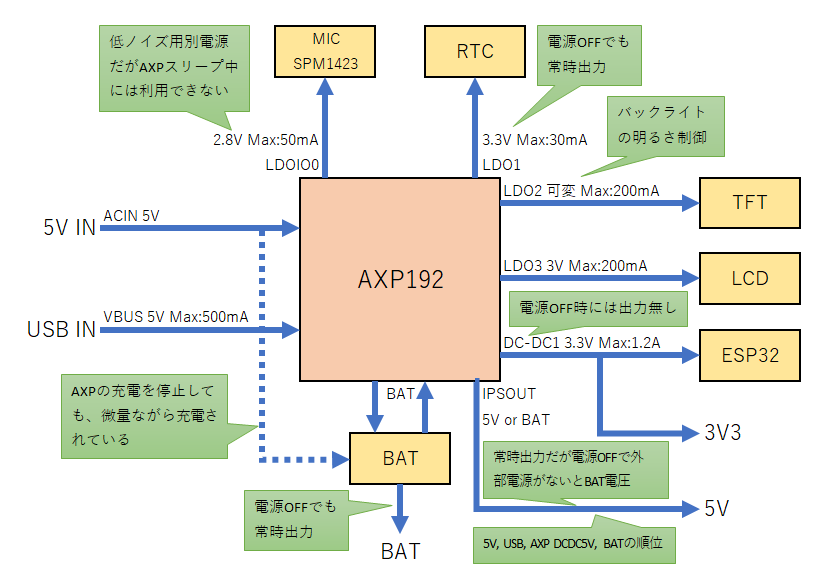

# AXP192の調査

電源の入出力周りの調査結果です。M5StickCの初期値が記述しています。

## 概要

ざっくりと電源周りをまとめてみました。5V出力がちょっと複雑ですが、あとは概ね想定内でした。
M5StickC以外にもAXP192は利用されそうですので、全般的な説明も追加しています。

## 入出力一覧

| PIO  | AXP NAME     | 接続先     | 電圧      | 電圧範囲     | 最大電流 | 備考     |
|------|--------------|------------|-----------|--------------|----------|----------|
| 入力 | VBUS         | USB 5V IN  | 5V        |              |          |          |
| 入力 | ACIN         | 5V IN      | 5V        |              |          |          |
| 出力 | DCDC1        | ESP32, 3V3 | 3.3V      | 0.7V〜3.5V   | 1.2A     |          |
| 出力 | DCDC2        | 未使用     |           | 0.7V〜2.275V | 1.6A     |          |
| 出力 | DCDC3        | 未使用     |           | 0.7V〜3.5V   | 0.7A     |          |
| 出力 | LDO1         | RTC        | 3.3V      | 1.25V〜3.3V  | 30mA     | 常時給電 |
| 出力 | LDO2         | TFT        | 3.0V      | 1.8V〜3.3V   | 200mA    | 低ノイズ |
| 出力 | LDO3         | LCD        | 3.0V      | 1.8V〜3.3V   | 200mA    | 低ノイズ |
| 出力 | GPIO0/LDOio0 | MIC        | 2.8V      | 1.8V〜3.3V   | 50mA     | 低ノイズ |
| 出力 | IPSOUT       | 5V OUT     | 5V or BAT |              |          |          |

入力はUSBからのVBUSと、5V入力のACINが別系統であります。両方接続しているときには、ACINが優先されます。

出力はDCDCが3系統、LDOが4系統あります。

## 電力入力端子

VBUSとACINは両方接続されていても問題ありません。その場合にはACINが優先されて利用されます。

### VBUS(USB)

USBからの電源供給です。VBUSは電流制限(0x30)が可能でM5StickCでは500mAまでの制限が入っています。3.8V以上の電源が入力されるとAXP192は自動起動します。

### ACIN(5V IN)

上部のHAT端子の5V INからの電源供給です。3.8V以上の電源が入力されるとAXP192は自動起動します。

## 電力出力端子

### DCDC1(ESP32, 3V3)

ESP32と3V3出力端子に3.3Vを出力します。電源ONの場合にしか出力されません。AXP192をスリープした場合でも出力され続けます。

### DCDC2, 3

M5StickCでは利用していません。

### LDO1(RTC)

RTCに接続されており、時刻を保存するために利用されています。
電源OFFになっていても出力されています。
おそらく接続的にはRTCのバッテリーを3.0Vまで充電するという動きをしているはずです。

### LDO2(TFT)

画面の明るさ制御に利用している電源です。電源OFFの場合や、AXP192をスリープすると出力されません。

### LDO3(LCD)

おそらくTFTの制御ボードであるST7735Sが利用している電源です。電源OFFの場合や、AXP192をスリープすると出力されません。

### GPIO0/LDOio0(MIC)

汎用的に利用できるGPIOですが、M5StickCは低ノイズの電源出力で利用しています。MICで利用しているSPM1423が接続されているはずです。

### IPSOUT

ここの出力はAXP192というよりは、利用するボードによって異なってくるはずです。基本的には5Vが出力されていますが、バッテリー電圧が出力される場合があります。

出力の優先順位は以下の通りです。

1. ACIN(5V IN)
2. VBUS(USB)
3. (AXP192電源ON)バッテリーのAXP192経由のDCDC 5V
4. (AXP192電源OFF)バッテリー電圧

外部電源が接続されていない場合でも、AXP192が電源ONであればDCDCを利用して5Vが出力されていますが、AXP192上で設定がないので外部DCDCを利用しているように思えます。

そのためAXP192が電源OFFの場合にはバッテリー電圧が出力されるので、3Vから4V程度の電圧出力になります。

### BAT

バッテリー電圧を出力する端子があります。この端子は常時出力されています。
おそらくAXP192経由で過放電は禁止されているはずですが、未検証です。

# 参考資料

- [RTC interrupt pin connected to ESP32 or not? #45](https://github.com/m5stack/M5StickC/issues/45)

