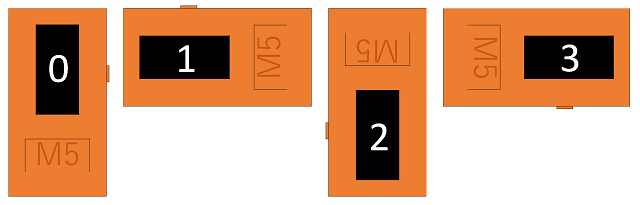

# M5Displayクラスの使い方

重要な情報のみ抜き出して解説します。

## 画面の向き
```
M5.Lcd.setRotation( r );
```

上記で画面の向きが設定できます。画面の向きは以下の画像を参考にしてください。



## 画面サイズ
```
int h = M5.Lcd.height();
int w = M5.Lcd.width();
```

上記で画面サイズが取得できます。setRotation()で回転したサイズに追従したサイズになります。

横80ドット、縦160ドットが標準の返却値です。

## 色

2バイト(R5, G6, B5ビット)で指定します。

```
uint16_t c = M5.Lcd.color565(r, g, b);
```

上記の関数で変換をするか、以下の定義済みの色を利用してください。

```
#define BLACK               0x0000      /*   0,   0,   0 */
#define NAVY                0x000F      /*   0,   0, 128 */
#define DARKGREEN           0x03E0      /*   0, 128,   0 */
#define DARKCYAN            0x03EF      /*   0, 128, 128 */
#define MAROON              0x7800      /* 128,   0,   0 */
#define PURPLE              0x780F      /* 128,   0, 128 */
#define OLIVE               0x7BE0      /* 128, 128,   0 */
#define LIGHTGREY           0xC618      /* 192, 192, 192 */
#define DARKGREY            0x7BEF      /* 128, 128, 128 */
#define BLUE                0x001F      /*   0,   0, 255 */
#define GREEN               0x07E0      /*   0, 255,   0 */
#define CYAN                0x07FF      /*   0, 255, 255 */
#define RED                 0xF800      /* 255,   0,   0 */
#define MAGENTA             0xF81F      /* 255,   0, 255 */
#define YELLOW              0xFFE0      /* 255, 255,   0 */
#define WHITE               0xFFFF      /* 255, 255, 255 */
#define ORANGE              0xFD20      /* 255, 165,   0 */
#define GREENYELLOW         0xAFE5      /* 173, 255,  47 */
#define PINK                0xF81F
```

## 画面塗りつぶし
```
M5.Lcd.fillScreen(BLACK);
```

上記のように指定して塗りつぶします。

## テキスト描画について

### フォントについて

```
M5.Lcd.setTextFont(font);
```

上記のようにフォントを指定できます。

| font | 中身                            |
|------|---------------------------------|
| 1    | Adafruit 8ピクセルASCIIフォント |
| 2    | 16ピクセルASCIIフォント         |
| 3    | 未設定                          |
| 4    | 26ピクセルASCIIフォント         |
| 5    | 未設定                          |
| 6    | 26ピクセル数字フォント          |
| 7    | 48ピクセル7セグ風フォント       |
| 8    | 75ピクセル数字フォント          |

この他に中国語フォントが入っていますが、GBK文字コードで指定するので、使わないほうが無難です。

日本語などを利用したい場合には、別途フォントを準備する必要があります。

- [Arduino(M5StickC)でefont Unicodeフォント表示 完結編](https://lang-ship.com/blog/?p=646)

### フォントサイズについて

```
M5.Lcd.setTextSize(size);
```

1-7まで指定できて、元の大きさを何倍にするかを指定します。ドット数じゃなくて倍率なので気をつけましょう。

### フォント描画色について

```
M5.Lcd.setTextColor(color);
M5.Lcd.setTextColor(color, bgcolor);
```

上記の関数で設定できます。背景色も同時に指定したほうがわかりやすいと思います。

### テキスト描画座標について
```
M5.Lcd.setTextDatum(datum);
```

上記のように設定できます。0以外は特殊な状況以外では使わないほうが無難です。


### カーソル座標について
```
M5.Lcd.setCursor(x, y);
M5.Lcd.setCursor(x, y, font);
```

上記のようにテキストを描画するカーソル位置を設定します。

### テキスト描画方法
```
M5.Lcd.setCursor(x, y, font);
M5.Lcd.print("text");
M5.Lcd.println("text");
M5.Lcd.printf("test %d", i);
M5.Lcd.printf("test %d", i);
M5.Lcd.drawString(text, x, y, font);
M5.Lcd.drawCentreString(text, x, y, font);
M5.Lcd.drawRightString(text, x, y, font);
```

いろいろな方法がありますが、主に使うのは上記の関数だと思います。

print系はSerialなどの出力と同じ方式ですが、座標が指定できませんので、あらかじめカーソルをセットする必要があります。

### 画像描画
```
M5.Lcd.drawBitmap(x, y, w, h, data);
M5.Lcd.drawXBitmap(x, y, bitmap, w, h, color);
```

drawBitmap()は2バイト単位の色データが並んでいる画像形式で、drawXBitmap()は1ビット1ピクセルの画像で、color色で塗りつぶします。

両方ともピクセル単位で描画しているだけなので、思ったより時間がかかります。

### 描画関数
```
M5.Lcd.drawPixel(x, y, color);
M5.Lcd.drawLine(x0, y0, x1, y1, color);
M5.Lcd.fillRect(x, y, w, h, color);
M5.Lcd.drawRect(x, y, w, h, color);
M5.Lcd.drawRoundRect(x0, y0, w, h, radius, color);
M5.Lcd.fillRoundRect(x0, y0, w, h, radius, color);
M5.Lcd.drawCircle(x0, y0, r, color);
M5.Lcd.drawCircleHelper(x0, y0, r, cornername, color);
M5.Lcd.fillCircle(x0, y0, r, color);
M5.Lcd.drawEllipse(x0, y0, rx, ry, color);
M5.Lcd.fillEllipse(x0, y0, rx, ry, color);
M5.Lcd.drawTriangle(x0, y0, x1, y1, x2, y2, color);
M5.Lcd.fillTriangle(x0, y0, x1, y1, x2, y2, color);
```

一般的な描画関数は実装されています。

## クラスリファレンス
- [画面管理(M5Display)](../../Class/M5Display/)
