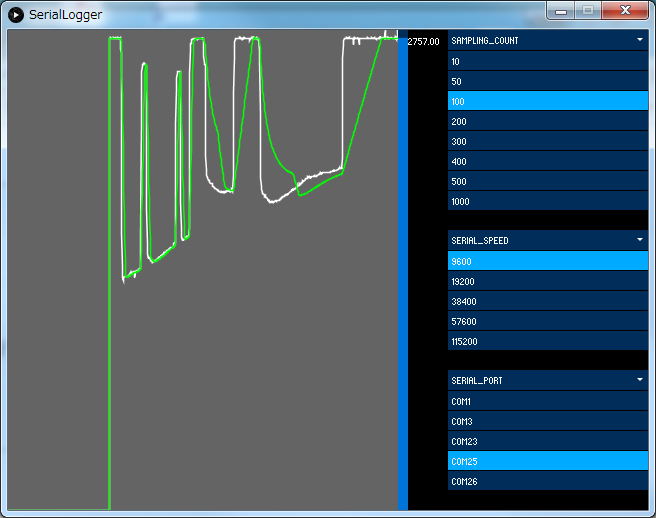

# リアルタイムデータロガー

間隔が1秒未満のリアルタイムデータを保存する場合には、外部サーバーなどに保存する方法が使えませんので、パソコンなどに接続して保存する必要があります。
Bluetooth Serialを使って、GROVE端子から取得したアナログセンサー値を送信するサンプルです。

省電力を意識しないコードでもM5StickCのバッテリーで、約25分間動作することができました。

時刻は本来M5StickC側のRTCで取得すべきかもしれませんが、RTCの時刻設定が正しいとは限らないのでパソコン側の時刻を利用しています。

## 概要

M5StickCにGROVE接続のアナログセンサーを取り付けて、そのデータを0.5秒間隔でBluetooth Serialで送信します。

PCからBluetooth Serialに接続して、そのデータをProcessingを使って受信して、グラフ化とCSV出力を行います。



## 機材一覧
- M5StickC
- [GROVE – GSRセンサ](https://www.switch-science.com/catalog/3401/)
- PC(Windows or Linux or Mac OS X)

## Processingとは？
Arduino IDEの元の元になったアプリケーションで、主にグラフィカルな処理を得意としている開発環境です。

Javaで動作しているので、Arduino IDEとは開発言語が違いますが、比較的簡単にマルチプラットフォームで動くプログラムを作ることが可能です。

[https://processing.org/](https://processing.org/)

### 利用ライブラリ
- controlP5

プルダウンやグラフの描画が簡単にできるcontrolP5を利用していますので、事前にライブラリに追加しておいてください。追加方法はほぼArduino IDEと同じなのですぐにわかると思います。

### 参考サイト
- [デザインとプログラミング 2017](https://yoppa.org/sfc_design17)

上記のページにProcessingやcontrolP5の追加などを、わかりやすくまとめられています。

## GSR(Galvanic Skin Response)センサとは？
皮膚への電流の流れやすさを測定するセンサで、汗などの影響によって測定値が変動します。手元にあったので利用しただけで、実際のところあまり使い所がありません。

## M5StickC側のコード [[Github](https://github.com/tanakamasayuki/M5StickC-examples/blob/master/RealtimeDataLog/M5StickCBluetoothSerialGroveAnalogInput/M5StickCBluetoothSerialGroveAnalogInput.ino)]
```
#include <M5StickC.h>
#include <BluetoothSerial.h>

BluetoothSerial SerialBT;
uint64_t chipid;
char chipname[256];

void setup() {
  chipid = ESP.getEfuseMac();
  sprintf( chipname, "M5StickC_%04X", (uint16_t)(chipid >> 32));
  M5.begin();
  M5.Lcd.setRotation(3);
  M5.Lcd.fillScreen(BLACK);
  M5.Lcd.printf("Bluetooth: %s\n", chipname);
  M5.Lcd.printf("Ver: %s %s\n", __DATE__, __TIME__);
  M5.Lcd.println();
  M5.Lcd.printf("Val:");

  SerialBT.begin(chipname);
}

void loop() {
  int val = analogRead(33);

  Serial.println(val);
  SerialBT.println(val);
  M5.Lcd.setCursor(8*4, 8*3);
  M5.Lcd.printf("%4d", val);
  delay(500);
}
```

hipidを取得して、SerialBTの待受名を指定しているので、複数のM5StickCがある場合でも個別に選択して接続が可能です。

同じ名前の方が好ましい場合はSerialBT.begin()の待受名を固定してください。

内容はGROVE端子のアナログ入力(IO33)を取得して、画面への表示とSerialとSerialBTにデータを送信しています。

SerialBTしか使わないのであれば、Serialに送信しないほうがバッテリーが持つかもしれません。

delay(500)なので、約0.5秒間隔での送信になります。どんどんずれていくので、厳密に送信したい場合には時刻などを見て、インターバルで送信する必要があります。

ちなみに、このコードで約25分の動作が可能です。LCDのバックライトを暗くするとか、ボタンで消せるようにするなどで、もう少し動作時間を伸ばすことは可能だと思います。

## Processing側のコード [[Github](https://github.com/tanakamasayuki/M5StickC-examples/blob/master/RealtimeDataLog/SerialLogger/SerialLogger.pde)]
```
import processing.serial.*;
import controlP5.*;
import java.util.*;
 
ControlP5 cp5;
Chart myChart;
 
int sizeW = 640;          // 画面横幅 640以上
int sizeH = 480;          // 画面縦幅 480以上
int samplingCount = 10;   // 未選択時のサンプリング数
int serialSpeed = 115200; // 未選択時の速度
int minValue = 0;         // グラフの最小値
 
Serial myPort;
 
int lf = 10;
int miliSec;
PrintWriter fp;
float maxValue;
Slider slider;
ArrayList<Integer> samplingList = new ArrayList<Integer>();
 
List<String> ls = new ArrayList<String>();
List<String> lc = new ArrayList<String>();
 
void settings() {
  size(sizeW, sizeH);
}
 
void setup() {
  int oldSec = second();
  for (int i = 0; i < 3000; i++) {
    // 起動時間からのミリ秒と時刻のミリ秒の差分を探す
    if ( oldSec != second() ) {
      miliSec = millis() % 1000;
      break;
    }
    delay(1);
  }
  cp5 = new ControlP5(this);
 
  // sampling
  lc.add("10");
  lc.add("20");
  lc.add("30");
  lc.add("40");
  lc.add("50");
  lc.add("100");
  lc.add("500");
  lc.add("1000");
  cp5.addScrollableList("sampling_count")
    .setPosition(sizeW-200, 0)
    .setType(ControlP5.LIST)
    .setSize(200, 200)
    .setBarHeight(20)
    .setItemHeight(20)
    .addItems(lc)
    ;
 
  // speed
  ls.add("9600");
  ls.add("19200");
  ls.add("38400");
  ls.add("57600");
  ls.add("115200");
  cp5.addScrollableList("serial_speed")
    .setPosition(sizeW-200, 190)
    .setType(ControlP5.LIST)
    .setSize(200, 200)
    .setBarHeight(20)
    .setItemHeight(20)
    .addItems(ls)
    ;
 
  List l = Arrays.asList(Serial.list());
  cp5.addScrollableList("serial_port")
    .setPosition(sizeW-200, 320)
    .setType(ControlP5.LIST)
    .setSize(200, 200)
    .setBarHeight(20)
    .setItemHeight(20)
    .addItems(l)
    ;
 
  String fileName = createFileName();
  fp = createWriter(fileName);
 
  myChart = cp5.addChart("")
    .setPosition(0, 00)
    .setSize(sizeW-250, sizeH)
    .setRange(0, 1)
    .setView(Chart.LINE);
 
  myChart.getColor().setBackground(color(255, 100));
 
  myChart.addDataSet("val");
  myChart.setColors("val", color(255, 255, 255), color(255, 0, 0));
  myChart.setData("val", new float[1000]);
 
  myChart.addDataSet("avg");
  myChart.setColors("avg", color(0, 255, 0), color(255, 0, 0));
  myChart.setData("avg", new float[1000]);
 
  myChart.addDataSet("min");
  myChart.setColors("min", color(0, 0, 255), color(255, 0, 0));
  myChart.setData("min", new float[1000]);
 
  myChart.setStrokeWeight(1.5);
 
  slider = cp5.addSlider("Value", 0, 1, 50, sizeW-250, 0, 10, sizeH);
}
 
float peek = 0;
float lastpeek = 0;
int mode = 0;
int lastvalue = 0;
 
void draw() {
  // 画面クリア
  background(0);
 
  // 何かデータを受信したら
  if ( myPort != null && myPort.available() > 0) {
    String data = myPort.readStringUntil(lf); // 文字列を受信
    if ( data != null ) {
      float value = float(trim(data));
      String timeStr = year()+"/"+month()+"/"+day()+" "+hour()+":"+minute()+":"+second()+".";
      int milisec = (millis()-miliSec)%1000;
      if ( milisec < 10 ) {
        timeStr = timeStr + "00";
      } else if ( milisec < 100 ) {
        timeStr = timeStr + "0";
      }
      timeStr = timeStr + milisec;
 
      fp.print( timeStr+",");
      fp.println(int(trim(data)));
      fp.flush();
 
      // 最大値更新
      if ( maxValue < value ) {
        maxValue = value;
        myChart.setRange(minValue, maxValue);
        slider.setRange(minValue, maxValue);
      }
 
      // 測定値追加
      samplingList.add((int)value);
      myChart.push("val", value);
 
      // 規定サンプル数以上の場合先頭削除
      if ( samplingCount < samplingList.size() ) {
        samplingList.remove(0);
      }
 
      // 移動平均計算
      int sum = 0;
      for ( int i = 0; i < samplingList.size(); i++ ) {
        sum += samplingList.get(i);
      }
      myChart.push("avg", sum / samplingList.size());
      slider.setValue(int(value));
 
      if ( lastvalue + 2 < ( sum / samplingList.size() ) ) {
        if ( mode == 1 ) {
          int j = myChart.getDataSet( "min" ).size() - 3;
          while ( 0 <= j && myChart.getDataSet("min").get( j ).getValue() == -1 ) {
            // 最後の値を探す
            j--;
          }
          println(j);
          if ( 0 <= j ) {
            lastpeek = peek;
            peek = sum / samplingList.size();
            j += 1;
            int jstart = j;
            println(j);
            for (; j < myChart.getDataSet( "min" ).size(); j++ ) {
              myChart.getDataSet("min").get( j ).setValue( lastpeek + ( ( peek - lastpeek)  / ( 1000 - jstart ) ) * ( j - jstart ) );
            }
          }
 
          mode = 0;
          myChart.push("min", peek );
        } else {
          myChart.push("min", -1 );
        }
      } else {
        myChart.push("min", -1 );
        if( ( sum / samplingList.size() ) + 20 < lastvalue ){
          mode = 1;
        }
      }
       
      lastvalue = sum / samplingList.size();
    }
  }
}
 
void serial_port(int n) {
  println(Serial.list()[n]);
  if ( myPort != null ) {
    myPort.stop();
  }
  myPort = new Serial(this, Serial.list()[n], serialSpeed);
}
 
void serial_speed(int n) {
  serialSpeed = Integer.parseInt( ls.get(n) );
}
 
void sampling_count(int n) {
  samplingCount = Integer.parseInt( lc.get(n) );
  samplingList.clear();
}
 
String createFileName() {
  String fileName= nf(year(), 2) + nf(month(), 2) + nf(day(), 2) +"-"+ nf(hour(), 2) + nf(minute(), 2) + nf(second(), 2);
  fileName += ".csv";
  return fileName;
}
```


白が測定値で、緑が移動平均です。Bluetooth Serialの場合には速度は何を選択しても通信が可能で、シリアルポートを選択すると受信を開始します。

プログラムのあるディレクトリにCSVファイルが出力されますので、そこに受信時間と受信した値が保存されます。

## 関連ブログ
- [M5StickCでGROVEのアナログ出力をBluetoothSerialで飛ばす](https://lang-ship.com/blog/?p=714)
