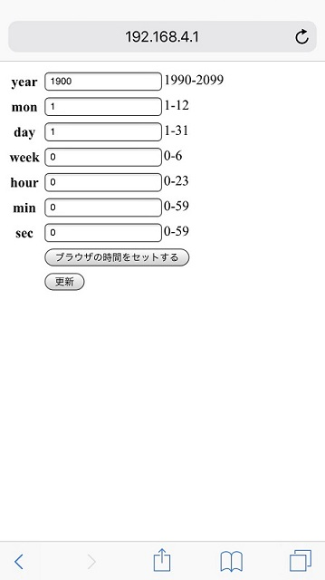

# RTCの現在日時をWebブラウザからセット

内蔵のRTCは現在時刻をセットしてからでないと利用することができません。

スマホなどがあればブラウザ経由でRTCの現在時刻を設定することができます。

## 概要

M5StickCをAPモードとしてWi-Fiルーターにし、スマホなどから接続後、ブラウザを利用して時刻合わせを行います。

JavaScriptを利用することで、スマホ側の時刻を送信することが可能です。



## サンプルスケッチ [[Github](https://github.com/tanakamasayuki/M5StickC-examples/blob/master/RTCSetWeb/RTCSetWeb.ino)]
```
#include <M5StickC.h>
#include <WiFi.h>
#include <WiFiClient.h>
#include <WiFiAP.h>
#include "time.h"

const char *ssid = "M5StickC";
const char *password = "";

WiFiServer server(80);

RTC_TimeTypeDef RTC_TimeStruct;
RTC_DateTypeDef RTC_DateStruct;

int lastDrawTime = 0;

void setup() {
  M5.begin();
  M5.Lcd.setRotation(3);
  M5.Lcd.fillScreen(BLACK);

  M5.Lcd.setTextSize(1);
  M5.Lcd.setCursor(40, 0, 2);
  M5.Lcd.println("RTC AP TEST");

  Serial.println("Configuring access point...");

  WiFi.softAP(ssid, password);
  IPAddress myIP = WiFi.softAPIP();
  Serial.print("AP IP address: ");
  Serial.println(myIP);
  server.begin();

  M5.Lcd.print("AP : " );
  M5.Lcd.println(ssid);
  M5.Lcd.print("IP : " );
  M5.Lcd.println(myIP);

}

void loop() {
  WiFiClient client = server.available();

  if (client) {
    Serial.println("New Client.");
    String currentLine = "";

    while (client.connected()) {
      if (client.available()) {
        char c = client.read();
        Serial.write(c);
        if (c == '\n') {
          if (currentLine.length() == 0) {
            client.println("HTTP/1.1 200 OK");
            client.println("Content-type:text/html; charset=utf-8;");
            client.println();

            client.println("<!DOCTYPE HTML>");
            client.println("<html>");
            client.println("<head>");
            client.println("<meta name=\"viewport\" content=\"width=device-width,initial-scale=1\" />");
            client.println("<script>");

            client.println("function clickBtn(){");
            client.println("  var jikan= new Date();");
            client.println("  document.time.year.value = jikan.getFullYear();");
            client.println("  document.time.mon.value  = jikan.getMonth()+1;");
            client.println("  document.time.day.value  = jikan.getDate();");
            client.println("  document.time.week.value  = jikan.getDay();");
            client.println("  document.time.hour.value = jikan.getHours();");
            client.println("  document.time.min.value  = jikan.getMinutes();");
            client.println("  document.time.sec.value  = jikan.getSeconds();");
            client.println("}");

            client.println("</script>");


            client.println("</head>");
            client.println("<body>");

            client.println("<form method=\"get\" name=\"time\">");
            client.println("<table>");
            client.println("<tr><th>year</th><td><input type=\"text\" name=\"year\" value=\"1900\" />1990-2099</td></tr>");
            client.println("<tr><th>mon</th><td><input type=\"text\" name=\"mon\" value=\"1\" />1-12</td></tr>");
            client.println("<tr><th>day</th><td><input type=\"text\" name=\"day\" value=\"1\" />1-31</td></tr>");
            client.println("<tr><th>week</th><td><input type=\"text\" name=\"week\" value=\"0\" />0-6</td></tr>");
            client.println("<tr><th>hour</th><td><input type=\"text\" name=\"hour\" value=\"0\" />0-23</td></tr>");
            client.println("<tr><th>min</th><td><input type=\"text\" name=\"min\" value=\"0\" />0-59</td></tr>");
            client.println("<tr><th>sec</th><td><input type=\"text\" name=\"sec\" value=\"0\" />0-59</td></tr>");
            client.println("<tr><th></th><td><input type=\"button\" value=\"ブラウザの時間をセットする\" onclick=\"clickBtn()\" /></td></tr>");
            client.println("<tr><th></th><td><input type=\"submit\" value=\"更新\" /></td></tr>");
            client.println("</table>");
            client.println("</form>");

            client.println("</body>");
            client.println("</html>");

            Serial.println("html Rendering");

            break;
          } else if (currentLine.indexOf("GET /?") == 0) {
            int pos1 = 0;
            int pos2 = 0;
            int val = 0;

            // Set RTC time
            RTC_TimeTypeDef TimeStruct;
            RTC_DateTypeDef DateStruct;

            // year
            pos1 = currentLine.indexOf('year=', pos2);
            pos2 = currentLine.indexOf('&', pos1);
            val = currentLine.substring(pos1 + 1, pos2).toInt();
            DateStruct.Year = val;

            pos1 = currentLine.indexOf('mon=', pos2);
            pos2 = currentLine.indexOf('&', pos1);
            val = currentLine.substring(pos1 + 1, pos2).toInt();
            DateStruct.Month = val;

            pos1 = currentLine.indexOf('day=', pos2);
            pos2 = currentLine.indexOf('&', pos1);
            val = currentLine.substring(pos1 + 1, pos2).toInt();
            DateStruct.Date = val;

            pos1 = currentLine.indexOf('week=', pos2);
            pos2 = currentLine.indexOf('&', pos1);
            val = currentLine.substring(pos1 + 1, pos2).toInt();
            DateStruct.WeekDay = val;

            pos1 = currentLine.indexOf('hour=', pos2);
            pos2 = currentLine.indexOf('&', pos1);
            val = currentLine.substring(pos1 + 1, pos2).toInt();
            TimeStruct.Hours = val;

            pos1 = currentLine.indexOf('min=', pos2);
            pos2 = currentLine.indexOf('&', pos1);
            val = currentLine.substring(pos1 + 1, pos2).toInt();
            TimeStruct.Minutes = val;

            pos1 = currentLine.indexOf('sec=', pos2);
            pos2 = currentLine.indexOf(' ', pos1);
            val = currentLine.substring(pos1 + 1, pos2).toInt();
            TimeStruct.Seconds = val;

            M5.Rtc.SetTime(&TimeStruct);
            M5.Rtc.SetData(&DateStruct);

            client.println("HTTP/1.1 200 OK");
            client.println("Content-type:text/html; charset=utf-8;");
            client.println();

            client.println("<!DOCTYPE HTML>");
            client.println("<html>");
            client.println("<head>");
            client.println("<meta name=\"viewport\" content=\"width=device-width,initial-scale=1\" />");
            client.println("</head>");
            client.println("<body>");
            client.println("更新しました<br />");
            client.println("[<a href=\"/\">戻る</a>]<br />");

            Serial.println("RTC Update");
            Serial.println("html Rendering");

            break;
          } else {
            currentLine = "";
          }
        } else if (c != '\r') {
          currentLine += c;
        }
      }
    }

    client.stop();
    Serial.println("Client Disconnected.");
  }

  if( lastDrawTime + 500 < millis() ){
    static const char *wd[7] = {"Sun", "Mon", "Tue", "Wed", "Thr", "Fri", "Sat"};
    M5.Rtc.GetTime(&RTC_TimeStruct);
    M5.Rtc.GetData(&RTC_DateStruct);
    M5.Lcd.setCursor(0, 16 * 2);
    M5.Lcd.printf("Data: %04d-%02d-%02d(%s)\n", RTC_DateStruct.Year, RTC_DateStruct.Month, RTC_DateStruct.Date, wd[RTC_DateStruct.WeekDay]);
    M5.Lcd.printf("Time: %02d : %02d : %02d\n", RTC_TimeStruct.Hours, RTC_TimeStruct.Minutes, RTC_TimeStruct.Seconds);
    lastDrawTime = millis();
  }
}
```

## 関連ブログ
- [M5StickCのRTCをブラウザからセットする](https://lang-ship.com/blog/?p=566)
