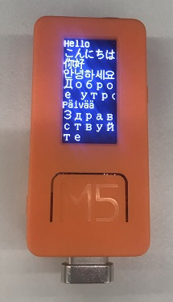

# 多言語(日本語)フォント表示

標準では英数と中国語フォントしか利用できませんが、/efont/さんの[Unicode Font](http://openlab.ring.gr.jp/efont/unicode/)を利用して、多言語(日本語)フォントを表示させました。

## 概要

フォントデータを文字単位で指定して、PROGMEM領域に読み込み、UTF8で渡された文字コードをUNICODEに変換してから描画しています。

/efont/ Unicode Fontに収録されているf16.bdfとb16.bdfを利用して1文字32バイトの16ピクセルフォントデータです。

全角文字はf16.bdfを利用し、U+00FFまでの文字は半角としb16.bdfを利用しています。



### 提供機能

- 文字単位での利用フォント選択
- UTF8をUNICODEに変換
- フォントデータ描画

## サンプルスケッチ [[Github](https://github.com/tanakamasayuki/M5StickC-examples/blob/master/efont/efont.ino)]
```
#include <M5StickC.h>
#include "efontEnableAll.h"
//#include "efontEnableAscii.h"
//#include "efontEnableCJK.h"
//#include "efontEnableJa.h"
#include "efont.h"
#include "efontM5StickC.h"
 
void setup() {
  M5.begin();
  M5.Lcd.setRotation(0);
  M5.Lcd.setCursor(0, 0);
 
  printEfont("Hello", 0, 16*0);
  printEfont("こんにちは", 0, 16*1);
  printEfont("你好", 0, 16*2);
  printEfont("안녕하세요", 0, 16*3);
  printEfont("Доброе утро", 0, 16*4);
  printEfont("Päivää", 0, 16*6);
  printEfont("Здравствуйте", 0, 16*7);
}
 
void loop() {
}
```

## フォントサイズを減らす方法

フォントは1文字単位で管理されており、1文字単位で読み込まない設定が可能です。
全21,729文字だと721Kのフォントデータになります。

efont.hより前に、読み込みフォントを指定することで、文字数を制御できます。

プリセットのリストを参考にして、読み込む文字を指定することで、文字単位で読み込みを制御することができます。

```
//#include "efontEnableAll.h"
//#include "efontEnableAscii.h"
//#include "efontEnableCJK.h"
#include "efontEnableJa.h"
#include "efont.h"
```

efontEnableJaMini.hは常用漢字と表外漢字とよく使いそうな記号が使え、一部の旧字や中国語、ハングル文字、諸外国語などは使えないコンパクトなフォントデータです。

## フォントサイズ

| 対象             | オプション          | 文字数 | フォント容量 |
|------------------|---------------------|-------:|-------------:|
| すべて           | efontEnableAll.h    | 21,727 | 738,718      |
| Ascii            | efontEnableAscii.h  |    191 |   6,494      |
| CJK漢字          | efontEnableCJK.h    | 19,379 | 658,886      |
| 簡体字中国語     | efontEnableCn.h     | 18,077 | 614,618      |
| 日本語           | efontEnableJa.h     | 10,835 | 368,390      |
| 日本語(常用＋α) | efontEnableJaMini.h |  4,107 | 139,638      |
| 韓国語           | efontEnableKr.h     |  8,319 | 282,846      |
| 繁体字中国語     | efontEnableTw.h     | 13,555 | 460,870      |

## 使い方

ヘッダファイルしかないので、利用するファイルをプロジェクトにコピーするか、以下のライブラリをArduino IDEに追加してください。

- [GitHub efontライブラリ](https://github.com/tanakamasayuki/efont)

