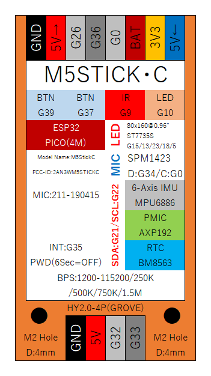

# Home

本資料は個人的に取りまとめた資料であり、オフィシャル情報ではありません。

横幅を1220ドット以上に広げると、上にナビがでて使いやすいです。

オフィシャル情報 [[Github](https://github.com/m5stack/M5StickC)].

## 端子別備考

### BAT端子
内蔵バッテリーの出力端子で、 3Vから4V程度が常に出力されています。

### 3V3
3.3Vが出力される端子で、この端子のみ電源OFFだと出力されません。

### 5V
5Vが出力される端子で、常に出力されています。

### GROVE 5V
Grove端子側の5V端子で、常に出力されています。ただ、GPIO32とGPIO33の入力は3.3Vまでなので、接続する装置によってはこの電源の5Vの入力がそのまま入る可能性があります。

とはいえ、実際のところ5Vの入力を入れても、すぐに壊れることはないようですが、正式には5V入力を許容していませんので注意して利用してください。

### GPIO0
基本的に3.3Vでプルアップされている端子で、電源オフ時とLOWの出力時以外はHIGHになっています。
ただLOWのときにもGNDレベルではなく150mV程度の電圧が出力されていました。

また、この端子をLOWに落としている時は、起動に失敗しますので接続には注意してください。

### GPIO26
非常にシンプルな端子で、素直に動きます。また、M5StickCではDAC出力に唯一使える端子でもあります。
ただし、ADC2_CH9に接続されているため、無線利用時にアナログ入力に利用することができませんので注意しましょう。

### GPIO36
入力専用端子で出力はできません。また、プルアップとプルダウンも利用できませんので注意しましょう。

### GPIO32, 33
Grove側の端子で、素直に動きます。Groveの電源が5Vですが、この端子の入力は3.3Vまでなので注意しましょう。

## データシート
- メインチップ [[ESP32](https://www.espressif.com/sites/default/files/documentation/esp32_datasheet_en.pdf)] [[ESP32 FAQ](https://www.espressif.com/sites/default/files/documentation/ESP32_FAQs__EN.pdf)]
- メインボード [[ESP32-PICO-D4](https://www.espressif.com/sites/default/files/documentation/esp32-pico-d4_datasheet_en.pdf)]
- M5StickC回路図 [[回路図](https://m5stack.oss-cn-shenzhen.aliyuncs.com/resource/docs/schematic/Core/M5StickC/20191118__StickC_A04_3110_Schematic_Rebuild_PinMap.pdf)]
- TFTスクリーン [[ST7735S](https://github.com/m5stack/M5-Schematic/blob/master/Core/ST7735S_v1.1.pdf)]
- マイクロフォン [[SPM1423](https://github.com/m5stack/M5-Schematic/blob/master/Core/SPM1423HM4H-B.pdf)]
- 6-axis IMU [[SH200Q](https://github.com/m5stack/M5-Schematic/blob/master/Core/SH200Q.pdf)]
- 6-axis IMU [[MPU6886](https://github.com/m5stack/M5-Schematic/blob/master/datasheet/MPU-6886-000193%2Bv1.1_GHIC.PDF.pdf)]
- 電源管理 [[AXP192](https://github.com/m5stack/M5-Schematic/blob/master/Core/AXP192%20Datasheet%20v1.13_cn.pdf)]
- RTC [[BM8563](http://www.belling.com.cn/media/file_object/bel_product/BM8563/datasheet/BM8563_V1.1_cn.pdf)]

## APIリファレンス
- [M5StickC](https://lang-ship.com/reference/M5StickC/latest/)
- [ESP32](https://lang-ship.com/reference/ESP32/latest/)
- [Arduino日本語](https://www.arduino.cc/reference/jp/) ※不完全
- [Arduino英語](https://www.arduino.cc/reference/en/)

## ピンアサイン

| PinMap                         | Name              | Type | Function                                                                   |
|--------------------------------|-------------------|------|----------------------------------------------------------------------------|
| 赤LED                          | IO10(SD3)         | I/O  | GPIO10, SD_DATA3, SPIWP, HS1_DATA3, U1TXD                                  |
| IR トランスミッタ              | IO9(SD2)          | I/O  | GPIO9, SD_DATA2, SPIHD, HS1_DATA2, U1RXD                                   |
| BUTTON A(Home)                 | IO37(SENSOR_CAPP) | I    | GPIO37, ADC1_CH1, RTC_GPIO1                                                |
| BUTTON B(右)                   | IO39(SENSOR_VN)   | I    | GPIO39, ADC1_CH3, RTC_GPIO3                                                |
| TFT_MOSI                       | IO15              | I/O  | ADC2_CH3, TOUCH3, RTC_GPIO13, MTDO, HSPICS0, HS2_CMD, SD_CMD, EMAC_RXD3    |
| TFT_CLK                        | IO13              | I/O  | ADC2_CH4, TOUCH4, RTC_GPIO14, MTCK, HSPID, HS2_DATA3, SD_DATA3, EMAC_RX_ER |
| TFT_DC                         | IO23              | I/O  | GPIO23, VSPID, HS1_STROBE                                                  |
| TFT_RST                        | IO18              | I/O  | GPIO18, VSPICLK, HS1_DATA7                                                 |
| TFT_CS                         | IO5               | I/O  | GPIO5, VSPICS0, HS1_DATA6, EMAC_RX_CLK                                     |
| GROVE SCL                      | IO33              | I/O  | 32K_XN (32.768 kHz crystal oscillator output), ADC1_CH5, TOUCH8, RTC_GPIO8 |
| GROVE SDA                      | IO32              | I/O  | 32K_XP (32.768 kHz crystal oscillator input), ADC1_CH4, TOUCH9, RTC_GPIO9  |
| Microphone SDA                 | IO34              | I    | ADC1_CH6, RTC_GPIO4                                                        |
| Microphone SCL Extended IO port | IO0               | I/O  | ADC2_CH1, TOUCH1, RTC_GPIO11, CLK_OUT1, EMAC_TX_CLK                        |
| Extended IO port               | IO36(SENSOR_VP)   | I    | GPIO36, ADC1_CH0, RTC_GPIO0                                                |
| Extended IO port               | IO26              | I/O  | GPIO26, DAC_2, ADC2_CH9, RTC_GPIO7, EMAC_RXD1                              |
| IMU & AXP SCL                  | IO22              | I/O  | GPIO22, VSPIWP, U0RTS, EMAC_TXD1                                           |
| IMU & AXP SDA                  | IO21              | I/O  | GPIO21, VSPIHD, EMAC_TX_EN                                                 |

- Wi-Fi利用時はIO0とIO26はアナログ入力として利用できません
- Microphone利用時はIO0を利用できません

## 内蔵I2Cアドレス
| モジュール                  | アドレス |
|-----------------------------|----------|
| Power Mangement IC (AXP192) | 0x34     |
| RTC(BM8563)                 | 0x51     |
| 6-axis IMU (MPU6886)        | 0x68     |
| 6-axis IMU (SH200Q)         | 0x6C     |

内蔵IMUはSH200QとMPU6886の端末があるので、どちらが搭載されているかは裏側の表示を見て確認してください。
