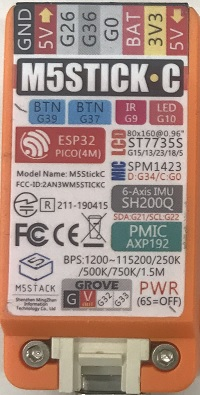
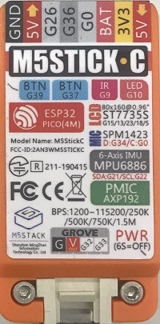
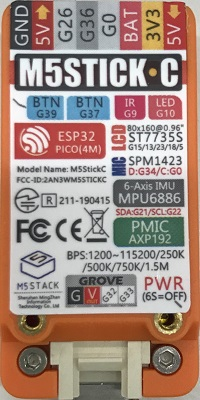

# 本体バージョン

M5StickCは何個かのバージョン(世代)があり、バージョンにより搭載しているチップや、仕様に若干の差があります。

| バージョン  | IMU     | BtnB      | シリアル | ネジ穴 | 表示                            |
|-------------|---------|-----------|----------|--------|---------------------------------|
| 0           | SH200Q  | 100mAバグ | 無し     | 無し   | 技適マーク無しのSH200Q          |
| 1           | SH200Q  | 正常      | 無し     | 無し   | 技適マーク有りのSH200Q          |
| 2           | MPU6886 | 100mAバグ | 後期のみ | 無し   | MPU6886で5V INが赤              |
| 3           | MPU6886 | 正常      | 有り     | 無し   | MPU6886で5V INが青、RTC表示追加 |
| 4           | MPU6886 | 100mAバグ | 有り     | 有り   | MPU6886で5V INが赤              |
| 5           | MPU6886 | 正常      | 有り     | 有り   | MPU6886で5V INが青、RTC表示追加 |
| 6           | MPU6886 | ?         | 有り     | 有り   | MPU6886で5V INが赤              |

## バージョン 0(試作機？)

Aliexpressで期間限定1ドルで販売していたバージョンです。
おそらくは試作機ぐらいの位置づけで、技適を取得していないので日本で動かすことはできません。

<blockquote class="twitter-tweet" data-lang="ja">
New Arrival 2019 M5StickC !!🎉🎉  $1 for Limited Trial Version🥳 Send us your awesome M5 works and get it now 😉 Don&#39;t miss this chance !  Details please click here👉: <a href="https://t.co/GFelv9xpuJ">https://t.co/GFelv9xpuJ</a><a href="https://twitter.com/hashtag/M5Stack?src=hash&amp;ref_src=twsrc%5Etfw">#M5Stack</a> <a href="https://twitter.com/hashtag/ESP32?src=hash&amp;ref_src=twsrc%5Etfw">#ESP32</a> <a href="https://twitter.com/hashtag/IoT?src=hash&amp;ref_src=twsrc%5Etfw">#IoT</a> <a href="https://twitter.com/hashtag/M5Stick?src=hash&amp;ref_src=twsrc%5Etfw">#M5Stick</a> <a href="https://twitter.com/hashtag/STEAM?src=hash&amp;ref_src=twsrc%5Etfw">#STEAM</a> <a href="https://t.co/KsqupPrUwG">pic.twitter.com/KsqupPrUwG</a>
&mdash; M5Stack (@M5Stack) <a href="https://twitter.com/M5Stack/status/1103979330848374784?ref_src=twsrc%5Etfw">2019年3月8日</a></blockquote>

買おうか迷いましたが、日本で使えない端末なので見送っていますので、所持していません。

特徴としては、以下の通りです。

- 技適マークがない
- LEDとIRのピン番号が誤って逆に記述されている
- BtnBを押すと100mA以上電流が流れる
- IMUはSH200Q

このバージョンの後期にLEDとIRのピン番号表記シールを直したものもあります。

<blockquote class="twitter-tweet" data-lang="ja">
GPS for M5StickC <a href="https://t.co/QJaBRFhN47">pic.twitter.com/QJaBRFhN47</a>
&mdash; M5Stack (@M5Stack) <a href="https://twitter.com/M5Stack/status/1113753764081610753?ref_src=twsrc%5Etfw">2019年4月4日</a></blockquote>

## バージョン 1(SH200Q)

日本で正式に販売されたバージョンです。
IMUがSH200Qで、バージョン 0の不具合が修正されています。

## バージョン 2(MPU6886赤)

IMUがMPU6886に変更されています。
変更に伴って修正されていた、BtnBを押すと100mA以上電流が流れる不具合が再発しています。

仕様的には変わりませんが、後期モデルにはM5STACK出荷時にシリアル番号がはられています。

## バージョン 3(MPU6886青)

5V INの表記が赤から、青に変わっています。おそらく5V OUTと同じ色なのでわけたと思われます。
BtnBを押すと100mA以上電流が流れる不具合はなおっています。
また、本体仕様に変更はないはずですが、RTCの記載が追加されています。

<blockquote class="twitter-tweet">
裏面のデザインが変わって老眼に厳しくなりましたw  RTCが増えてますね。元のBM8563と変わったわけではなさそう。 <a href="https://t.co/YgObS8SP21">pic.twitter.com/YgObS8SP21</a>
&mdash; 紅樹　タカオ (@mongonta555) <a href="https://twitter.com/mongonta555/status/1190089840169123840?ref_src=twsrc%5Etfw">November 1, 2019</a></blockquote> 

## バージョン 4(スクリュー付き)

本体仕様的には100mA以上電流が流れる不具合があるので、バージョン 3の方が新しい気がしますが、スクリュー付きで、赤バージョンです。
今後はスクリュー付きで青バージョンが登場してくると思われます。

## バージョン 5(青スクリュー付き)

<blockquote class="twitter-tweet">
M5StickCネジ青のperfect version検証 – Lang-ship  とりあえずネジ付き青バージョンの電源周りだけ確認しました <a href="https://t.co/cc9fFS9V5Q">https://t.co/cc9fFS9V5Q</a>
&mdash; たなかまさゆき (@tnkmasayuki) <a href="https://twitter.com/tnkmasayuki/status/1214111008156868608?ref_src=twsrc%5Etfw">January 6, 2020</a></blockquote> 

perfect versionと呼ばれている青ネジ穴付きです。
基本的にはこのバージョンで完成なのかな？

## バージョン 6(赤スクリュー付きRTC表記あり)

現在の最新版です。現物は入手できていませんが右上の5V INの色が青から赤に戻りました。ラベルにRTCが表記されている場合には最新バージョンの仕様と思われます。

## 番外編 白

白バージョンも試作されていたみたいです。
ちなみにCはカラーではなくコンパクトだったはずです。

<blockquote class="twitter-tweet" data-lang="ja">
Grove cover is coming <a href="https://t.co/VvyHIC7VWN">pic.twitter.com/VvyHIC7VWN</a>
&mdash; M5Stack (@M5Stack) <a href="https://twitter.com/M5Stack/status/1103850802450440193?ref_src=twsrc%5Etfw">2019年3月8日</a></blockquote>

## 番外編 Cじゃないやつ

コンパクトじゃないやつもあります。ただし技適なしなので日本では使えません。

<blockquote class="twitter-tweet">
See the difference of M5Stack <a href="https://t.co/DuxmeXGGK7">pic.twitter.com/DuxmeXGGK7</a>
&mdash; M5Stack (@M5Stack) <a href="https://twitter.com/M5Stack/status/1095266372702089216?ref_src=twsrc%5Etfw">February 12, 2019</a></blockquote> 

## 番外編 分解写真

<blockquote class="twitter-tweet" data-lang="ja">
Hey M5 users, there are over 200 people joining our $1 M5StickC event, but now i just received 77 emails, pls hurry up! deadline tomorrow!!! m5stack <a href="https://t.co/8GbaArp00O">pic.twitter.com/8GbaArp00O</a>
&mdash; M5Stack (@M5Stack) <a href="https://twitter.com/M5Stack/status/1106180742873268224?ref_src=twsrc%5Etfw">2019年3月14日</a></blockquote>

<blockquote class="twitter-tweet" data-lang="ja">
<a href="https://twitter.com/hashtag/M5stickC?src=hash&amp;ref_src=twsrc%5Etfw">#M5stickC</a> 分解。上の基板と、端子台になっている下の基板のピンは、はんだで止めてあるので、分解できませんので、よい子はマネしないようにｗ　今回は、分解して自作ケースにつけるより、M5stickCはケースのまま、自作ケースを作ってはめる作戦のほうがよさそうかなー＾＾ <a href="https://t.co/wA9iMksgAt">pic.twitter.com/wA9iMksgAt</a>
&mdash; 山岡 敬章 (@AiLab_Japan) <a href="https://twitter.com/AiLab_Japan/status/1117100967822909441?ref_src=twsrc%5Etfw">2019年4月13日</a></blockquote>

